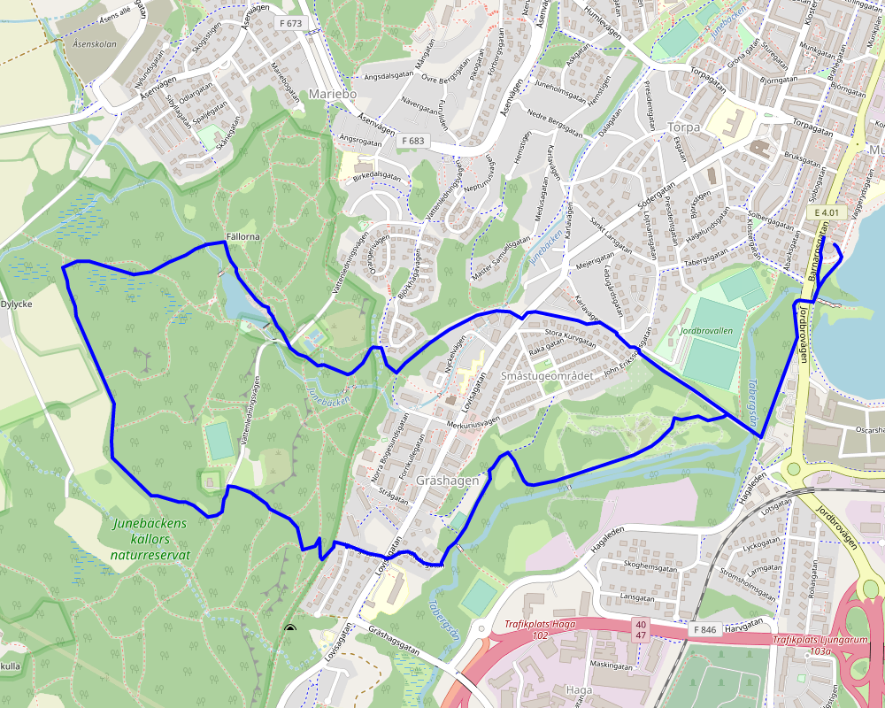

När jag tittar på vad jag sprungit för rundor under mitt ganska korta liv kan jag se att de flesta av mina rundor ser ungefär likadana ut. De är alla runt 5--7km och är alltid förbi något trevligt ställe.{.lead}

Jag tror de flesta som springer har en runda som de kan ge sig ut på som de inte behöver tänka eller planera något för. En runda man nästan kan springa rundan med ögonbindel och som är lagom lång. Hur detta ser ut varierar säkert mycket från person till person.

Här i Jönköping verkar denna runda för många vara Munksjöpromenaden som går runt Munksjön mitt i city; Jag har sprungit denna många gånger men för mig är den helt enkelt för tråkig, jag vill få lite utsikt och lite natur.

**Bort från vimlet, staden och allt!**

## Trelleborg

Min första sådan runda är i *Trelleborg*{title="Min födelsehemort"} på exakt [exakt 5 kilometer](ostra-stranden_5km.gpx){download}. Den går bara fram och tillbaka längs med stranden mellan Åhus och Gislövs läge. Mestadels på sandiga stigar och gräs.

{.-wide}

## Jönköping

Varje gång jag flyttat har jag hittat en ny runda som utgår från hemmet. I Jönköping blev min första sådan Rosenlunds bankar. Jag skulle nog säga att det fortfarande är min favorit!

### Rosenlunds bankar

Denna rundan var min vanligaste när jag bodde på Rosenlund, den är [5.3km lång](bankarna_5.3km.gpx){download} och gav fantastisk utsikt över Vättern, dock var den kanske lite för kylig på vinterhalvåret.

{.-wide}

### Vattenledningsparken

När jag 2016 flyttade till Munksjöstaden och närmre centrum blev Vattenledningsparken (*numera även naturreservatet Junebäckens källor*) min hemvist med löpskorna.

{.-wide}

Eftersom Vattenledningsparken ligger en bit bort blev denna rundan något längre än min tidigare standarddistans på 5km, denna är på [7.2km](vattenledningsparken_7.2km.gpx).

{.-wide}

:::: gallery {.-wide}
::: row
{.-inline}
{.-inline}
:::
::::

### Dunkehallaravinen & stadsparken

2019 flyttade jag in till Jönköpings centrum och då blev Vattenledningsparken otillgänglig på alla rundor kortare än en mil, jag springer fortfarande där då och då men för mina vanliga rundor behövde jag något kortare.

Då blev Dunkehallaravinen med alla trapporna och Stadsparken den perfekta rundan på [5.9km](dunkehallatrapporna_5.9km.gpx).

Rundan börjar med lite mer än en kilometer med platt asfalt, sen kommer nästan alla höjdmeter på en gång uppför trapporna. Därefter går rundan genom Stadsparken där jag kan springa förbi ett utegym och sen lite skön nedförsbacke ner till stan.

:::: gallery {.-wide}
::: row
{.-inline}
{.-inline}
:::
::: row
{.-inline}
{.-inline}
:::
::::