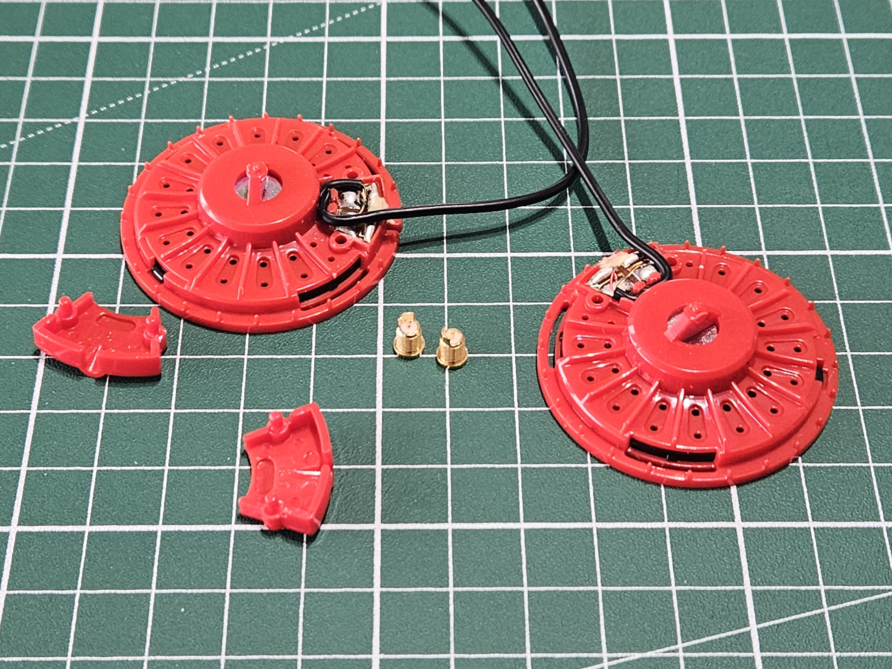
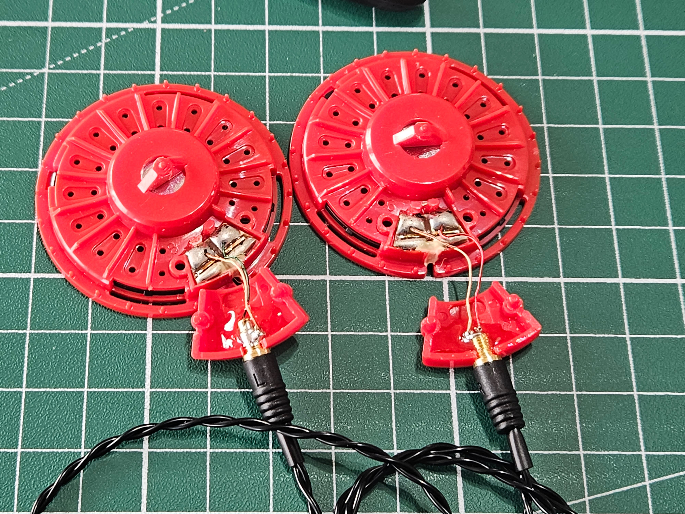
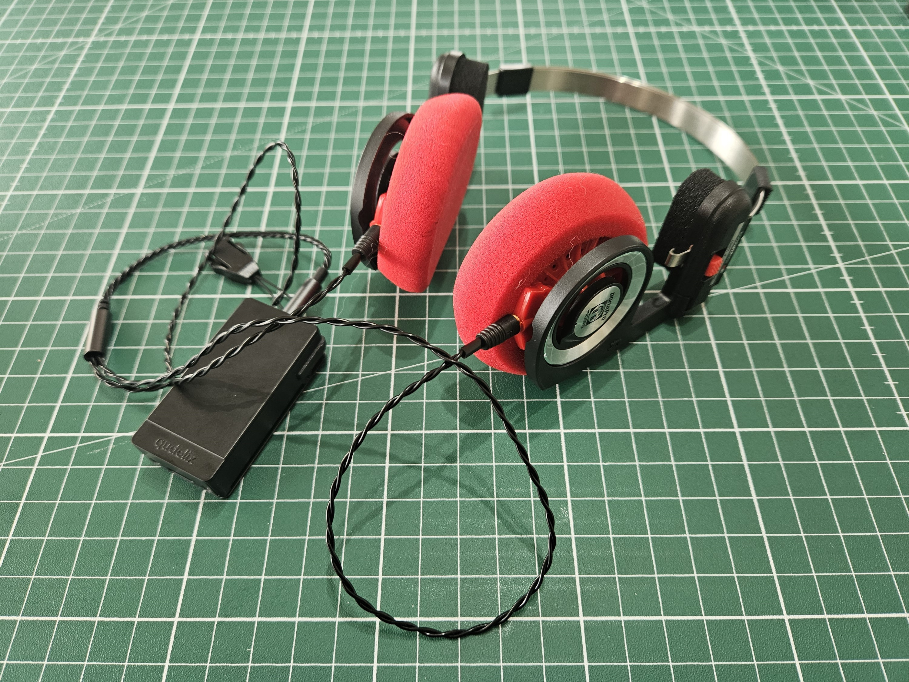

Jag har alltid uppskattat mina Koss Porta Pro, det är inga hörlurar som kommer vinna priset i någon audiofiltävling och det är inte ett par hörlurar som gör att du kan höra varken alla detaljer i musik eller det som artisten ville. Oavsett det så är det alltid en ren njutning att lyssna i dem.{.lead}

Hörlurarna har jag haft i åratal och använt dem då och då, mest när jag spelat Nintendo Switch, men sällan för just musik, delvis på grund av döden för 3,5mm-porten.

Över åren har jag gjort små uppgraderingar till hörlurarna för att lyfta dem en nivå högre.

## Yaxi

Den första uppgraderingen jag gjorde var att byta till hörlurskuddar från Yaxi, de är lite hårdare och tjockare vilket gör att elementen kommer lite längre ifrån öronen och gör ljudet ännu mer luftigt, vilket är en av lurarnas redan stora styrkor.

## Qudelix 5K

Den andra uppgraderingen jag gjorde var att köpa en DAC med blåtand. Jag valde Qudelix 5K efter läst att många rekommenderade den, främst för att den har stöd för equalizer, och inte bara en simpel 10-bands utan full parametrisk som gör att ljudet kan manipuleras med precision.

Parametrisk equalizer kombinerat med [inställningar från Oratory1990](https://old.reddit.com/r/oratory1990/comments/jx27p7/the_effect_of_yaxi_earpads_on_the_koss_porta_pro/) lyfte hörlurarna ytterligare några snäpp. Oratory1990 har gjort mätningar på hundratals hörlurar (inklusive Koss Porta Pro med just Yaxi-pads) och gjort instruktioner för hur man kan nå [Harmans målkurva](https://www.headphonesty.com/2020/04/harman-target-curves-part-1/) för varje hörlur.

Blåtand gjorde också hörlurarna lite smidigare att lyssna på och gör att jag oftare sätter på mig dem istället för att bara använda [mina Samsungbönor](https://en.wikipedia.org/wiki/Samsung_Galaxy_Buds_Live) som är smidiga men tråkiga.

Det enda som behövde förbättras var nu kabeln, som med en blåtandsdongel som enkelt kan sitta på tröjkragen var onödigt lång på 1,3m.

## MMCX

Den sista uppgraderingen jag gjorde var att byta ut originalkablarna till MMCX-kopplingar som jag sedan kunde koppla en kort 40cm kabel till.

Första steget var att ta ut elementen och ta bort originalkablarna. Därefter tog jag en dremel för att göra hålet tillräckligt stort för att få plats med MMCX-kopplingarna.

:::: gallery {.-wide}
::: row
{.-inline}
{.-inline}
:::
::::

Det svåraste momentet var att löda fast de centimeter av den gamla kabeln jag lät vara kvar på den nya kopplingen. Jag hade inte rört en lödkolv på över 10 år så det var en liten utmaning, att MMCX-kopplingen var runt 3mm stor gjorde det inte lättare.

Men med lite svordomar så blev det helt okej till slut, använde nog på tok för mycket lödtenn men det blev ingen kortslutning och kablarna sitter nu fast.

Sista steget var att fylla ut området runt MMCX-kopplingen med epoxilim för att se till att de sitter fast ordentligt, de ska klara av att man drar ut kablarna många gånger.

:::: gallery {.-wide}
::: row
{.-inline}
{.-inline}
:::
::::

Väldigt nöjd med slutresultatet. Ofta sätter jag på mig lurarna det första jag gör när jag kommer hem på dagarna.

{.-full}

*[DAC]: Digital Audio Converter, en enhet som konverterar en digital ljudsignal till en analog ljudsignal.
