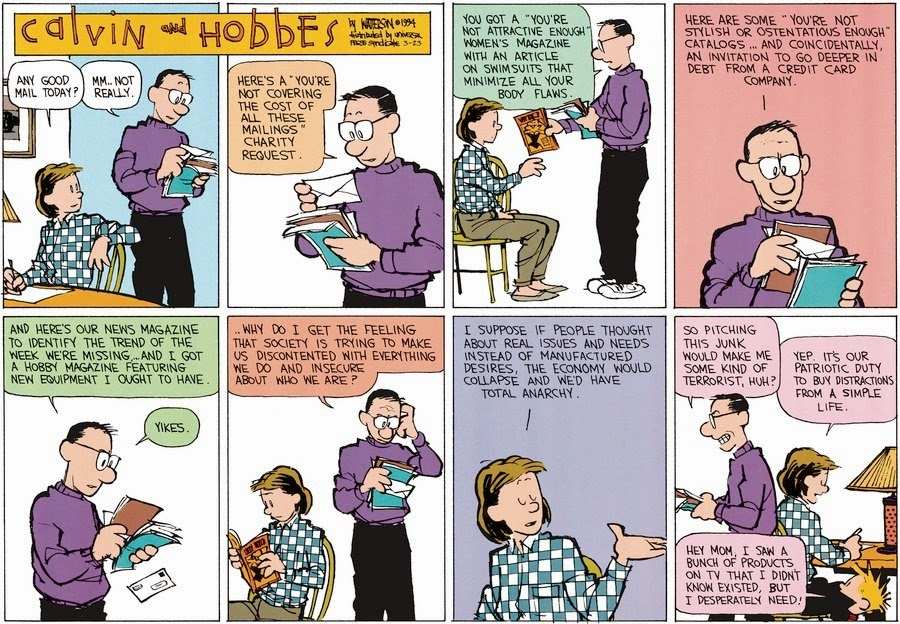

När vi ska bry oss om miljön köper vi ekologiskt, när vi ska bry oss om arbetsförhållanden köper vi fairtrade och snart kommer vi säkert börja spendera våra pengar på företag som är HBTQ-certifierade eller något liknande.

**När blev** _**att rösta med plånboken**_ **det allmänt accepterade sättet att påverka vår omvärld?**

Idag blir vi påverkade ifrån alla håll av reklam och meddelanden om hur vi ska leva, och framförallt vilka produkter och tjänster vi ska köpa för att uppnå de ideal som samma reklam får oss att vilja uppnå.

Även om målen är gemensamma i att förbättra miljön, arbetsförhållanden, jämlikhet och mycket mer är metoden _att rösta med plånboken_ lika passiviserande som det de kallar för [clicktivism](http://www.theguardian.com/commentisfree/2010/aug/12/clicktivism-ruining-leftist-activism).

Ett annat problem med _att rösta med plånboken_ är att det förflyttar makt till de som har mer pengar. En politik som vill förflytta fler områden _(som skola, omsorg, polisväsendet?)_ ut på marknaden förflyttar också ännu mer makt till de som har pengar och bort från de som har lite.

_Detta är konsumtionssamhället. Ett samhälle där en del av populationen sitter på produktionen och den andra halvan konsumerar. Hela samhället är fastlåst i denna konstellation. När det konsumeras mindre går ekonomin sämre och de pengar som kommer in via skatter som är tänkt att finansiera vår infrastruktur räcker till sämre och sämre._

## Mer konsumtion?

Således uppmanas vi att konsumera mer, genom reklam, sänkta lån för att uppmana till mer konsumtion och mer. Vi är skuldsatta upp över öronen för att hålla igång det system vi skapat som i dagsläget håller på att förstöra världen med nedskräpning, föroreningar och allmän miljöförstörelse. Ett system som inte tar i beräkning många viktiga saker som egentligen är det som håller ihop samhället för att istället lägga fokus på andra. Det har gett oss ett system som lägger mer värde i en telefonförsäljare än på en omtänksam förälder som tar hand om sin familj.

## Makerkultur

Jag tror att det finns en bättre väg vi kan föra samhället i. En väg där vi som kan aktivt vara en del av utvecklingen, där vi alla skapar, använder, modifierar de produkter och tjänster vi använder dagligen. Jag tror inte att framtidens produkter kommer vara skapade av ett enormt multinationellt företag i stora kinesiska (eller vilket land nu storskalig produktion görs i då) fabriker. Med möjligheterna som 3D-skrivare för med sig kan vi flytta produktionen lokalt.

Idag är 3D-skrivarna för konsumenter inte riktigt där men utvecklingen går fort. Samtidigt som vi gör allt fler av våra tjänster till digitala. _Trenden är tydlig_.

**Gustaf Josefsson pratade mycket om detta på Webbdagarna 2014 förra månaden.**

[Makerkulturen](http://en.wikipedia.org/wiki/Maker_culture) har möjligheten att aktivera oss alla i samhällets utveckling och ge oss tillbaka kontrollen av det vi gör och använder i vår vardag istället för att passivisera så som konsumtionskulturen gör.
