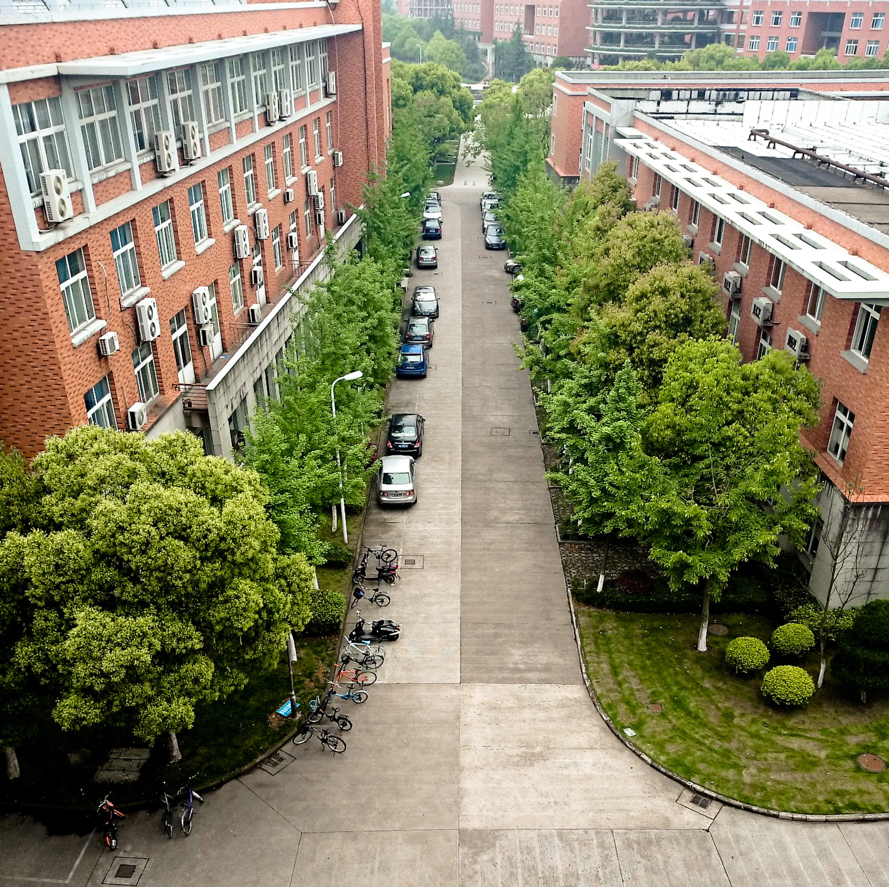

Efter regn kommer solsken sägs det och det är samma sak i Kina. Det har regnat i några dagar nu och först idag blev det fint.{.lead}

:::: gallery {.-wide}
::: row
{.-inline}
{.-inline}
{.-inline}
:::
::::

Eftersom jag inte tagit så mycket bilder på campus gick jag och Tobbe en runda och fotograferade. Med Google's nylanserade kamerapp i högsta hugg tog jag lite [photospheres som kan ses här](https://photos.app.goo.gl/cMUKw6WfxMtHKZT5A); Min plan är att fylla på det albumet med alla photospheres som jag tar.

Här är det närmsta supermarket där vi kan köpa lite allt möjligt.

{.-full}

Detta är parken som ligger intill vad jag tror är biblioteket.

{.-full}
