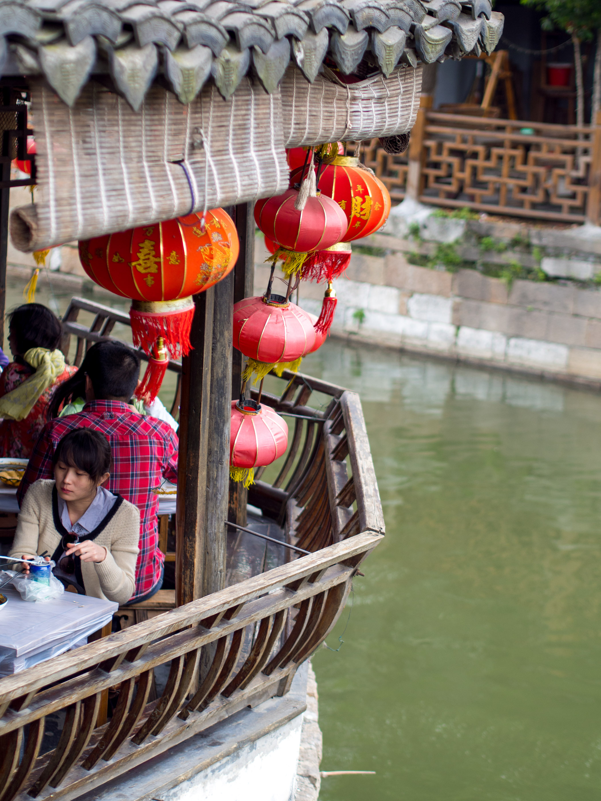
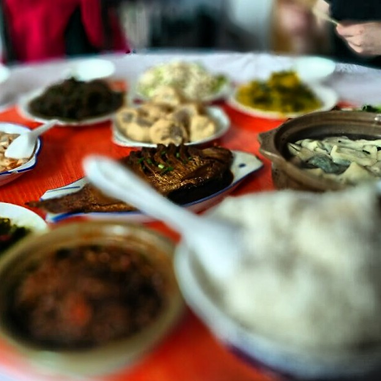

Mellan arbetet med vårt projekt gjorde vi en del utflykter, en av dem var till kanalstaden [Xitang][Wikipedia - Xitang] som beskrivs av många som Kinas Venedig, på många sätt var det en träffande beskrivning, den var både pittoresk och en turistfälla.{.lead}

<figure class="gallery -wide">
	<figure class="gallery-row">
		{.-inline}
		{.-inline}
		{.-inline}
	</figure>
</figure>

Det var väldigt fint, men ganska lite att göra, några timmar här hade räckt och inte en heldag som det blev (Vi åkte i en gemensam buss dit).

{.-full}

Marcus beskriver upplevelsen kanske bäst i sin vlogg som vi slängde ihop medan vi väntade på bussen hem.

<figure class="embed video -wide"><iframe width="560" height="315" src="https://www.youtube-nocookie.com/embed/92gOSBZ_Ph4" title="YouTube video player" frameborder="0" allow="accelerometer; autoplay; clipboard-write; encrypted-media; gyroscope; picture-in-picture; web-share" allowfullscreen></iframe></figure>

<figure class="gallery">
	<figure class="gallery-row -no-wrap">
		{.-inline}
		{.-inline}
	</figure>
</figure>

[Wikipedia - Xitang]: https://en.wikipedia.org/wiki/Xitang