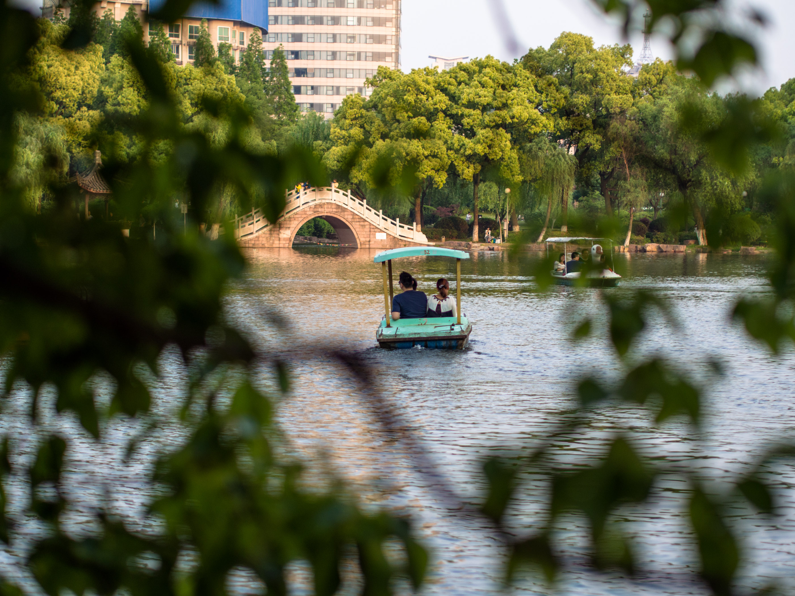
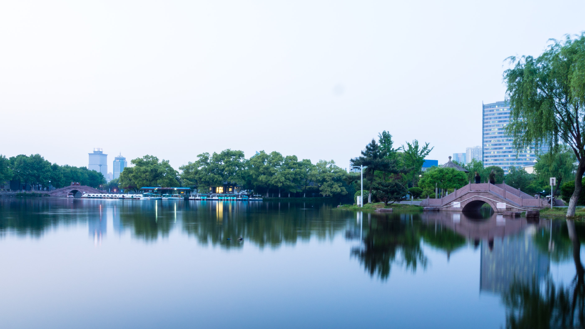
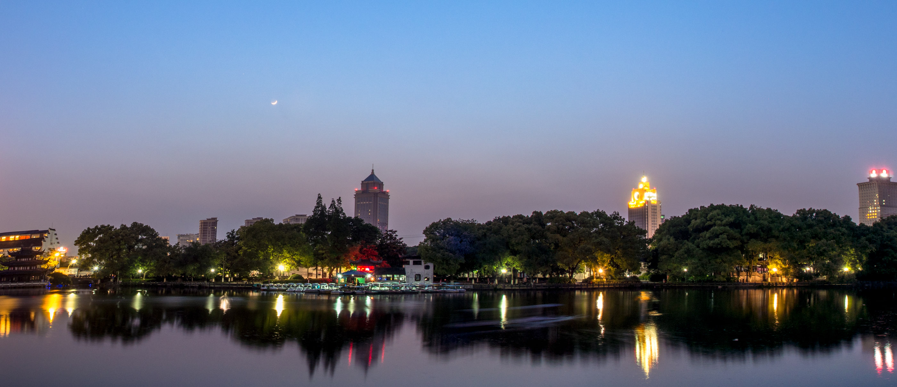

En kort taxiresa från campus i Ningbo ligger 月湖, eller Moon Lake Park som det också heter. Jag och Jossan tog en eftermiddag och kväll här borta från resten av gänget och gick runt och fotograferade.{.lead}

<figure class="gallery -wide">
	<figure class="gallery-row">
		{.-inline}
		{.-inline}
	</figure>
	<figure class="gallery-row">{.-inline}</figure>
</figure>

Efter att solen gått ner lade det sig ett lugn över hela parken, det dök även upp flera grupper av människor som körde någon form av gruppträning med yoga på några av de stora gräsmattorna.

{.-full}

När mörkret lade sig ordentligt gjorde parken verkligen rätt för sitt namn, den spegelblanka ytan reflekterade alla lampor från staden runt och nymånen reste sig över parken.

{.-full}
