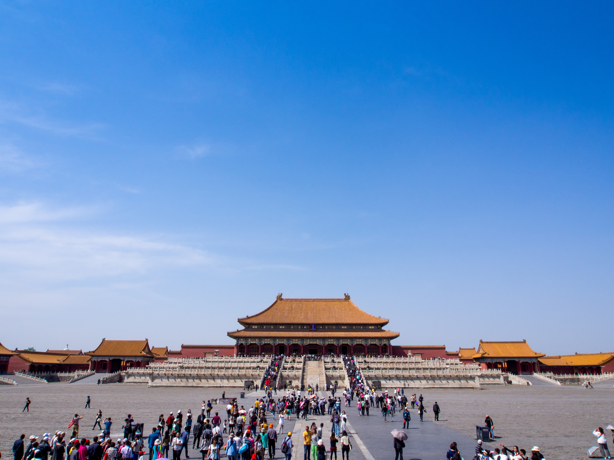
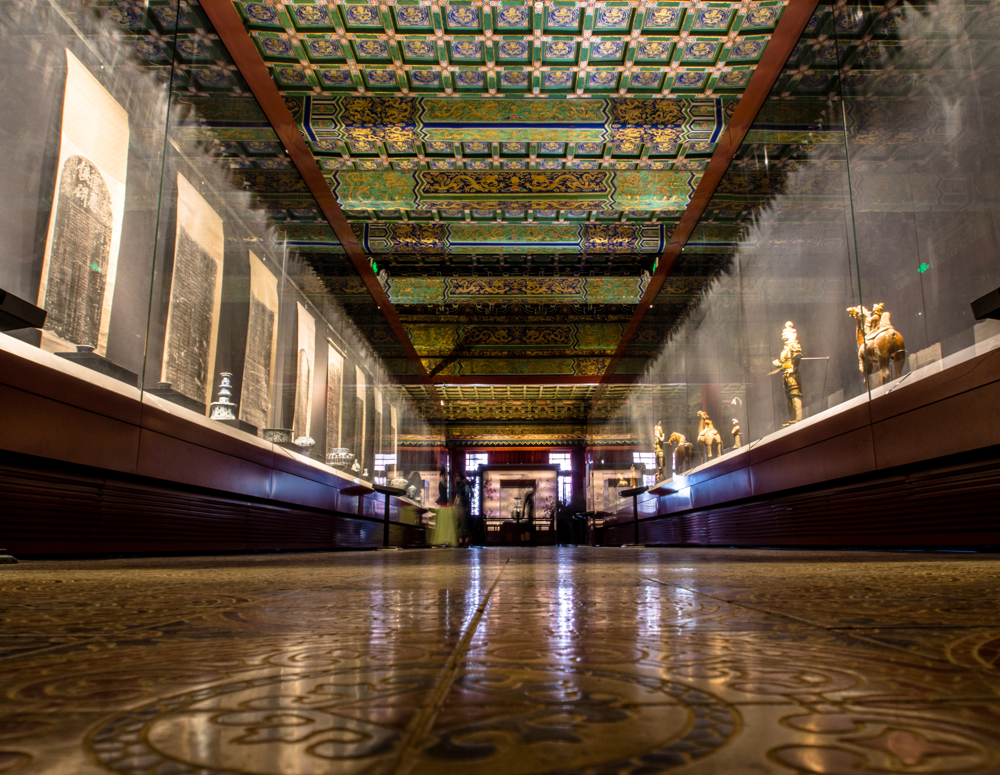
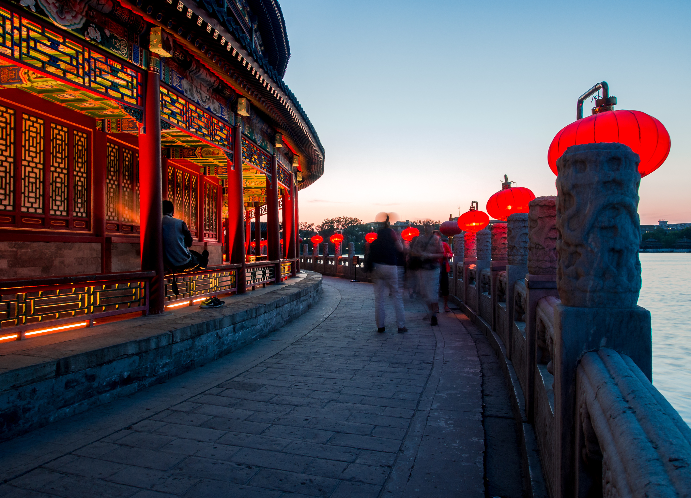

Äntligen är vi turister igen!{.lead}

Efter tre veckors slit är vi färdiga med vårt case som vi gjorde här i Kina och har nu sagt hejdå till Ningbo och tagit tåget till Beijing. Tågresan är nog en av de smidigaste jag någonsin åkt med, det är nog bättre att jämföra med flyg än något annat, incheckning och så var väldigt likt för flygresor men gick mycket snabbare.

Framme i Beijing tog vi en taxi till hotellet (i en trafik som är myyycket lugnare än Ningbo, men som även gjorde taxiresorna lite dyrare). Hotellet heter King Parkview Hotel och är ett stenkast ifrån Förbjudna Staden vilket underlättade idag :)

{.-wide}

Vi kunde knappast fått bättre väder när vi gick till Förbjudna Staden idag, den enda nackdelen var att det gjorde resten av Beijing också. Men efter en timmes stångande i kön kom vi till slut in, och det var stort! :)

_Alla mina bilder kan ses i [mitt album på Flickr](https://www.flickr.com/photos/gustavlindqvist/sets/72157644062428820/). Rekommenderar även att titta på alla [photospheres](https://photos.app.goo.gl/cMUKw6WfxMtHKZT5A) och bilder på [Instagram](https://instagram.com/gustavlindqvist). Det finns ett flertal gamla bilder från bland annat vårt besök i vattenstaden Xitang och ifrån ett parkbesök i Ningbo._

Min favoritbyggnad måste vara Hall of Literary Glory i Förbjudna Staden, den används som museum för keramik och har en mysig dunkel belysning som gjorde sig väldigt bra för lite fotografering :)

Senare på kvällen idag besökte vi ett parkområde som heter Beihai Park. Det var knappt något folk och det måste vara det mysigaste stället jag sett hittills!

Imorgon ska vi åka till Kinesiska muren, det ska bli häftigt! 😀
