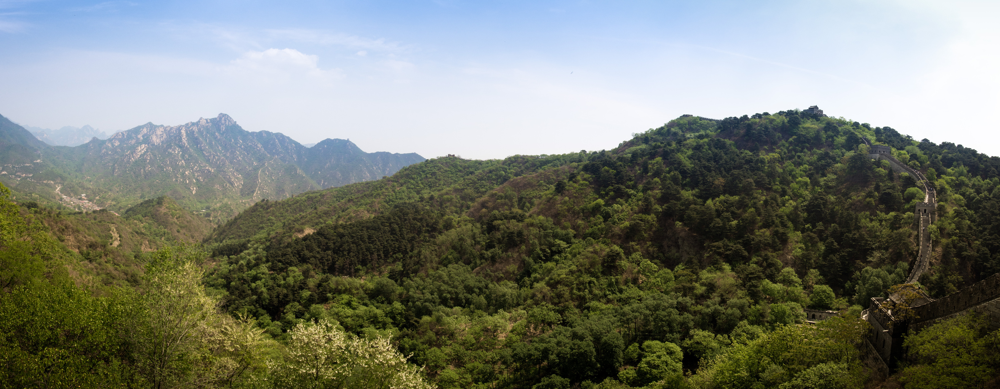

Idag har vi varit och besökt den kinesiska muren, vi hade bokat en privat tour som vi tog till ett av de mindre populära men ansett av de flesta vara en av de finaste delarna av den kinesiska muren, **Mutianyu**.{.lead}

För att komma upp till muren åkte vi med en sittlift upp drygt hundra meter _(det fanns möjlighet att gå men vi tyckte att det skulle vara tillräckligt att klättra på muren)_ När vi kom upp belönades vi med utsikten i bilden nedan, inte så dåligt! :)

{.-full}

Under drygt tre timmar klättrade vi upp till tornet som syns till höger på bilden; När jag skriver klättra menar jag det bokstavligen, vissa delar var mer som en lodrät klättervägg än en trappa. Lite här och där var det försäljare som sålde läsk, öl, vatten och lite blandat godis _(för drygt fyrdubbla normala priset, trots det köpte vi ändå lite förfriskningar när vi klättrade ner igen)_.

När man skulle ner fick man åka med en rutschkana (och man fick inte fotografera, fast det gjorde vi ändå)

<figure class="embed"><iframe width="560" height="315" src="https://www.youtube-nocookie.com/embed/KiydBeuMLvU?si=Hd7rnn5E7xmkVTIr" title="Riding toboggan" frameborder="0" allow="accelerometer; autoplay; clipboard-write; encrypted-media; gyroscope; picture-in-picture; web-share" referrerpolicy="strict-origin-when-cross-origin" allowfullscreen></iframe></figure>
