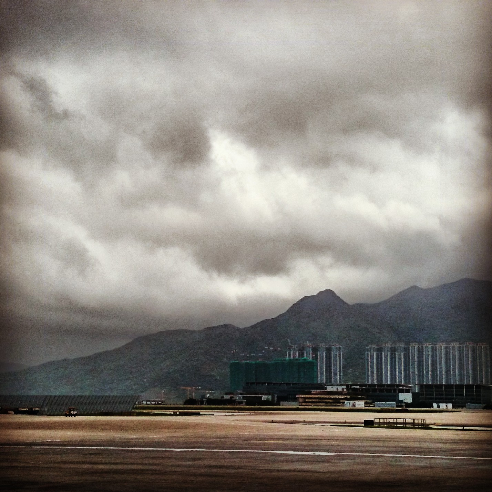
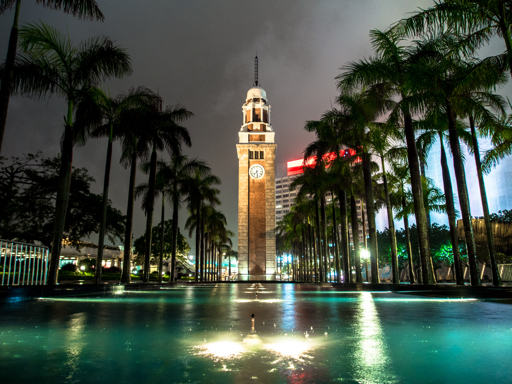
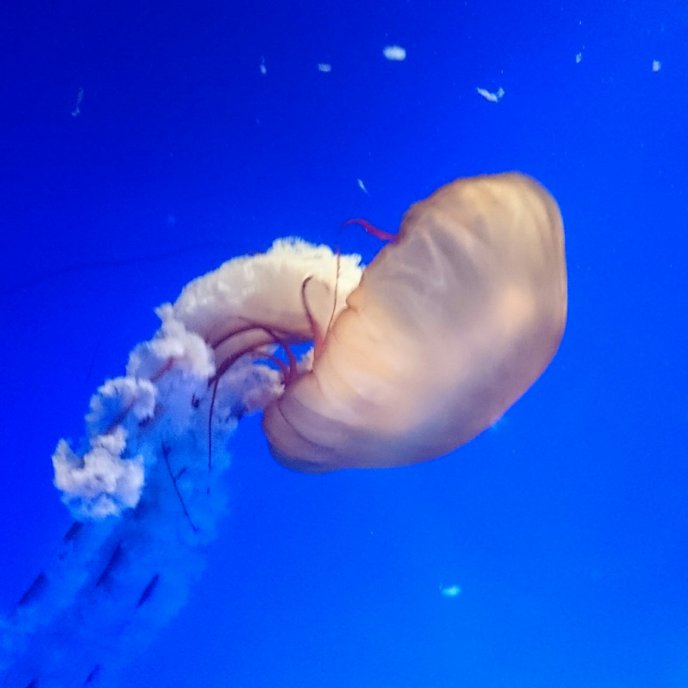
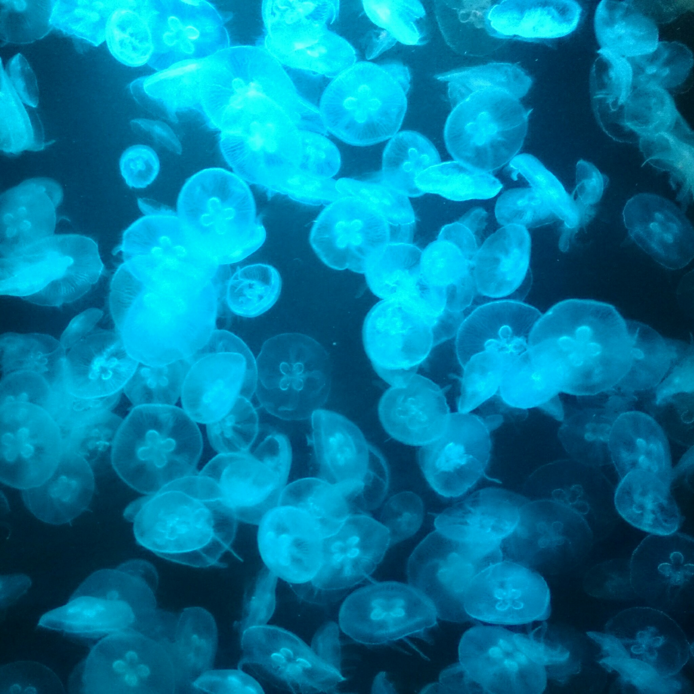
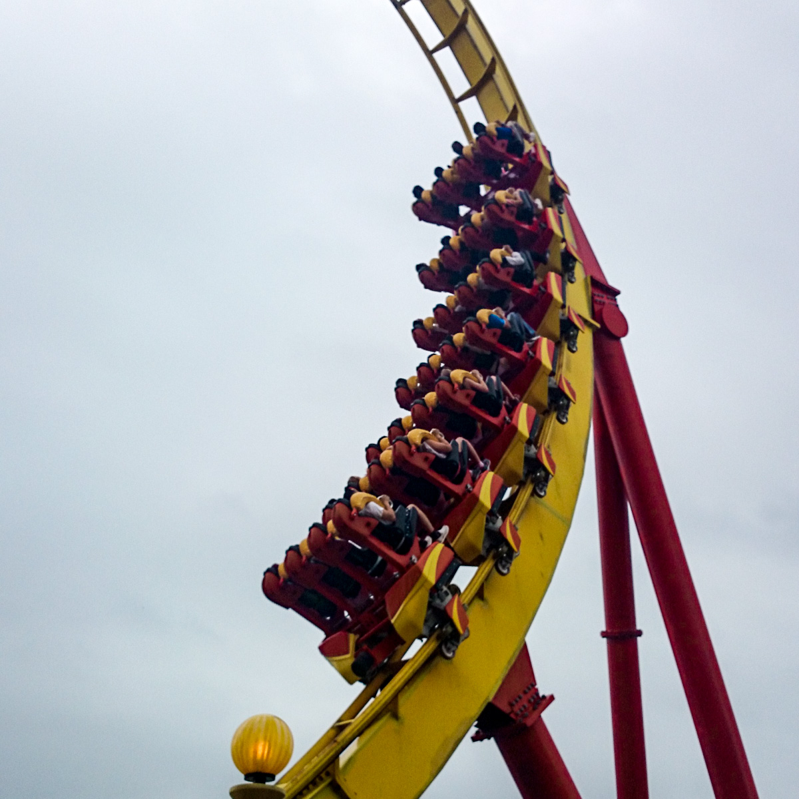
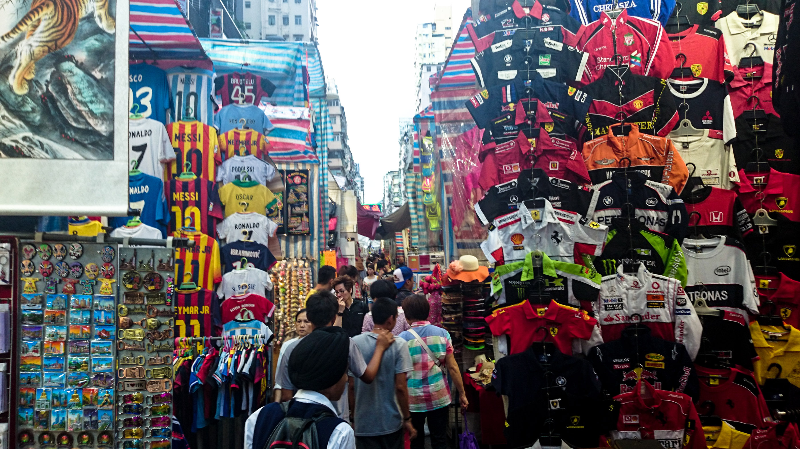
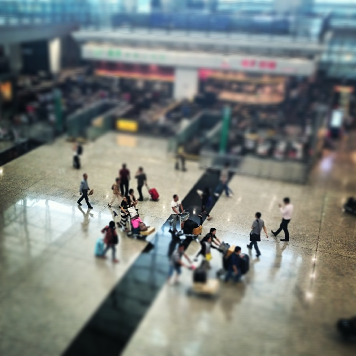

För 3 dagar sedan [landade vi i Hong Kong](http://instagram.com/p/nzT5Z2SKnj/). Som ni kan se om ni följer länken så bröt jag mot elektronikförbudet när vi landade :) Lätt värt det.{.lead}

:::: gallery {.-wide}
::: row
{.-inline}
{.-inline}
:::
::::

## Dag 1

Hong Kong gav ett mycket gott första intryck, [tunnelbanesystemet](http://instagram.com/p/nzp6mHyKsX/), skyttelbussar, taxis och i stort sett alla transporter fungerar mycket smidigt; i de flesta fall är det bara att betala, hoppa på och sen av. Inga konstigheter!

Efter några veckor där man vant sig vid kinesiska priser i Yuan och att får ett byte mot Hong Kong-priser i HKD blev det en totalchock. Från att ha kunnat äta sig mätt för typ 30 kr en hel dag till att betala Minst 100 kr för ett enda mål mat blir det lite skillnad.

Även om Hong Kong är i stort sett kinesiskt så känns det väldigt mycket som en västerländsk stad. Allt skrivs oftast på engelska och det mesta av staden är kraftigt inspirerat av London.

Hong Kong som turiststad har mycket att erbjuda, speciellt om man är intresserad av shopping. Igår besökte vi ett gigantiskt köpcenter som heter Harbor City. Det var så stort att man knappt kunde se änden av vissa korridorer. Här fanns en av de bästa bokhandelsbutiker jag varit i, de hade verkligen allt! :) Det var rena rama turen att jag kom därifrån utan något köpt.

{.-wide}

Innan vi åkte tillbaka till Hong Kong Island där vårt hotell är passade vi på att titta på det berömda _Symphony of Stars_ som är en ljusshow med musik som visas varje kväll på alla stora byggnader i skyline. Det var mycket coolt dock regnade det extremt mycket (vi stod i en decimenter djupt vatten). Vid slutet av showen hade regnovädret som pågått under dagen gått över till kraftig åska, sådan som man bara kan se i tropiska zoner.

{.-full}

Någon timme senare kom vi tillbaka dyblöta till hotellet helt slut i hela kroppen efter en lång dag med mycket promenerande. Jag somnade väldigt snabbt :)

## Dag 2

Idag har vi besökt huvudattraktionen på vår Hong Kong vistelse, Ocean Park.{.lead}

{.-full}

Ocean Park är beläget på andra sidan Hong Kong Island med bästa utsikt och läge. Fyllt med massor med karuseller, berg- & dalbanor och diverse attraktioner kring djur, både från ovan och under havets yta.

:::: gallery {.-wide}
::: row
{.-inline}
{.-inline}
:::
::::

Favoriten här måste vara Grand Aquarium, allt från enorma stingrockor till hajar och småfisk med gångar där man kunde gå rakt igenom och under akvariet, det var riktigt awesome.

{.-wide}

Ocean Park är uppdelat i två delar, en halva som ligger i dalen, där fanns akvariet och lite andra attraktioner; Den andra delen finns på toppen av berget där det är mestadels karuseller.

Ocean Park avslutades med att se på deras fontänshow med specialeffekter.

<figure class="embed"><iframe title="Symbio!" src="https://video.gustavlindqvist.se/videos/embed/e91251e2-915b-43ab-a364-d7494b5d8e3a?start=5s&amp;title=0&amp;warningTitle=0&amp;peertubeLink=0&amp;p2p=0" allowfullscreen="" sandbox="allow-same-origin allow-scripts allow-popups" width="560" height="315" frameborder="0"></iframe></figure>

## Dag 3

Tredje och sista dagen började med att vi bytte hotell till ett som var närmre flygplatsen. Här var det den fina poolen som vi fick ha i princip ensamma som var huvudattraktionen.

{.-wide}

Vi spenderade inte all tid i poolen, det blev även en tur in till _Sneaker street_, en gatumarknad full med fejkprodukter.

Efter en natt på hotellet var sista delen på resan avklarad och det var "bara" resan hem kvar.

:::: gallery {.-wide}
::: row
{.-inline}
{.-inline}
:::
::::

The end.
