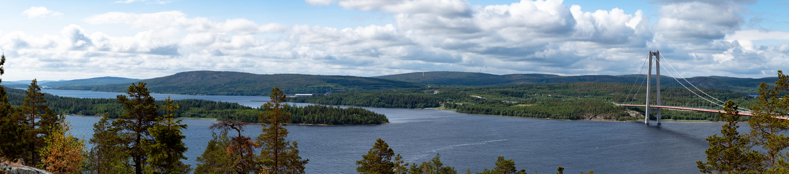
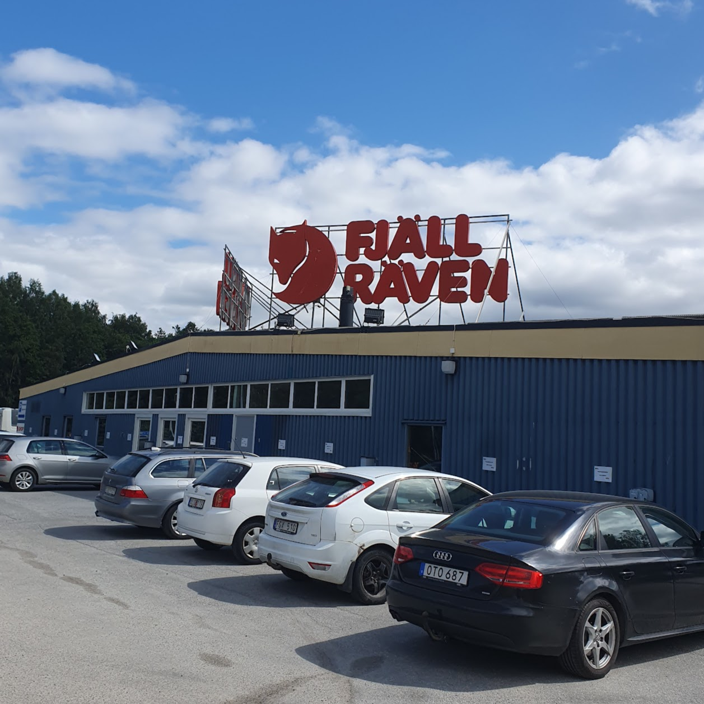

Förra lördagen rullade vi iväg med vår hyrbil för att ta den långa turen upp till Stöttingfjället och Fäboliden. Resan upp delade vi upp i två etapper där vi körde ~8 timmar till Härnösand första dagen och sedan de resterande 4-5 timmarna upp dagen därpå.{.lead}

Josefine hade tittat ut en massa fina rastplatser med lagom avstånd mellan som vi regelbundet stannade på, vi bytte också så vi körde varannat pass.

Eftersom vi hade kortare distans andra dagen passade vi på att stanna på lite ställen. Först ut var Högakustenbron.

{.-full}

Vi följde E4:an norrut längs Höga kusten. Planen var att svänga av upp mot Lycksele vid Nordmaling, egentligen är det kortare att göra det vid Örnsköldsvik men det är ganska dåliga vägar så vi valde ändå att köra vidare längs E4:an för att få mindre tid på dåliga vägar.

Innan vi svängde av gjorde vi dock ett kort (eller ganska långt) stopp på Fjällräven/Naturkompaniets outlet i Ö-vik.

