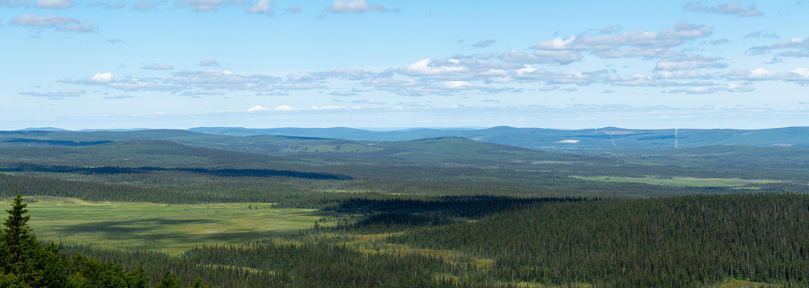
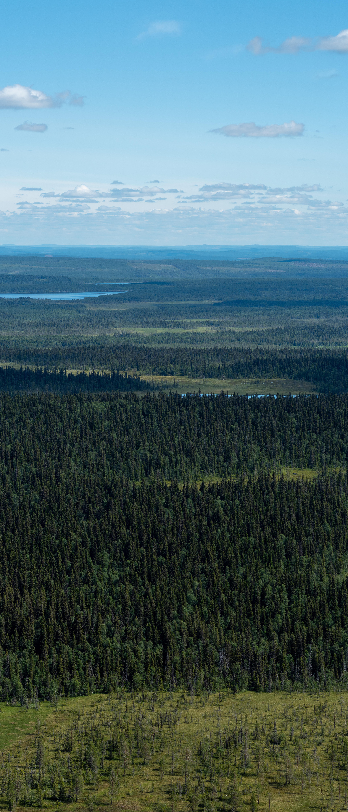
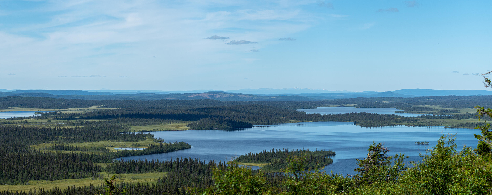

Stöttingfjället är ett stort, oklart definierat område i södra Lappland och Alsberget är dess högsta topp. Tyvärr är vägen dit flera mil längs mycket dåliga grusvägar förstörda av tjäle och tunga fordon; Men det hindrade inte oss från att ta oss upp.{.lead}

På toppen sitter flera antenner så det går grusväg hela vägen upp till toppen, därifrån är det sen bara en liten promenad bort till utsiktsplatserna.

{.-full}

:::: gallery {.-wide}
::: row
{.-inline}
{.-inline}
:::
::::

Berget var fullt av fäbromsar som attackerade bilen och oss så länge som vi var där. Som tur var blev ingen av oss biten.

{.-full}
