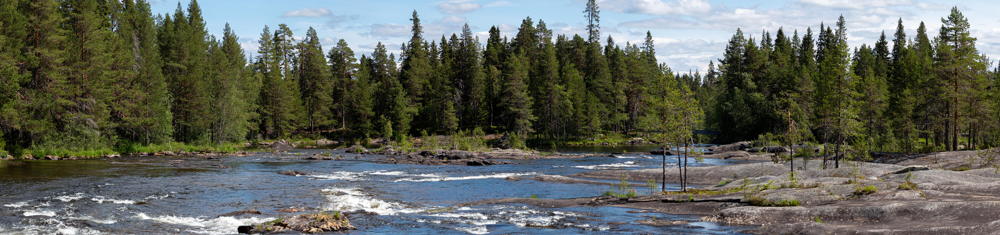
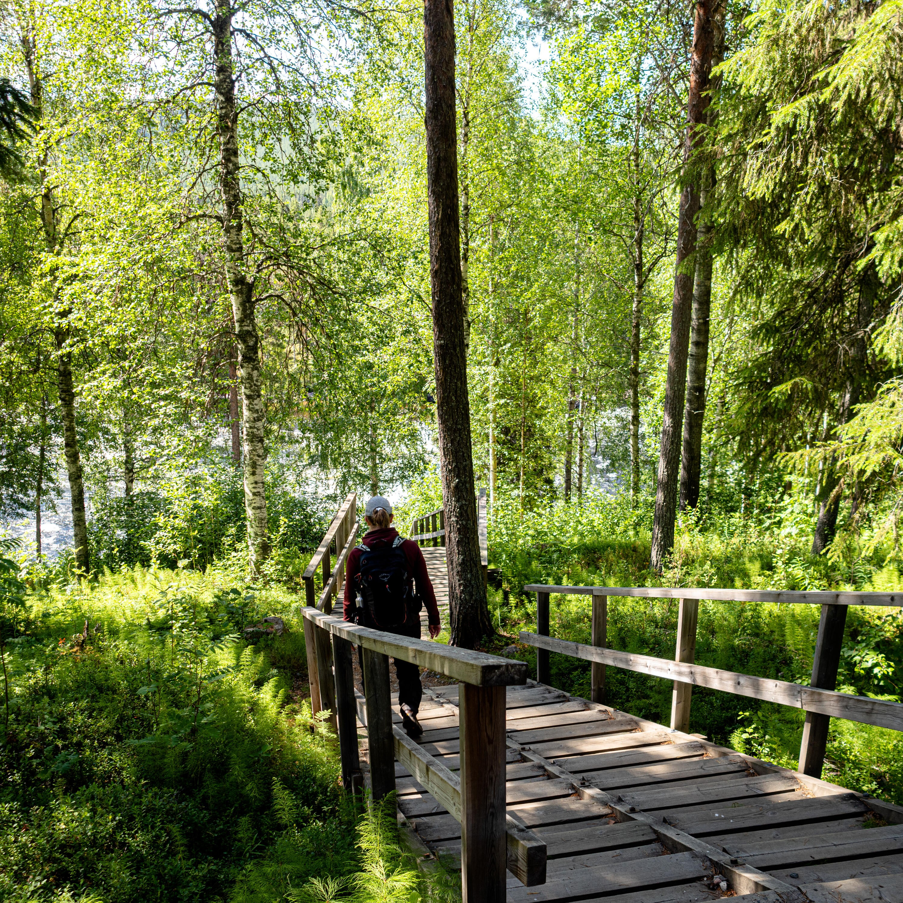
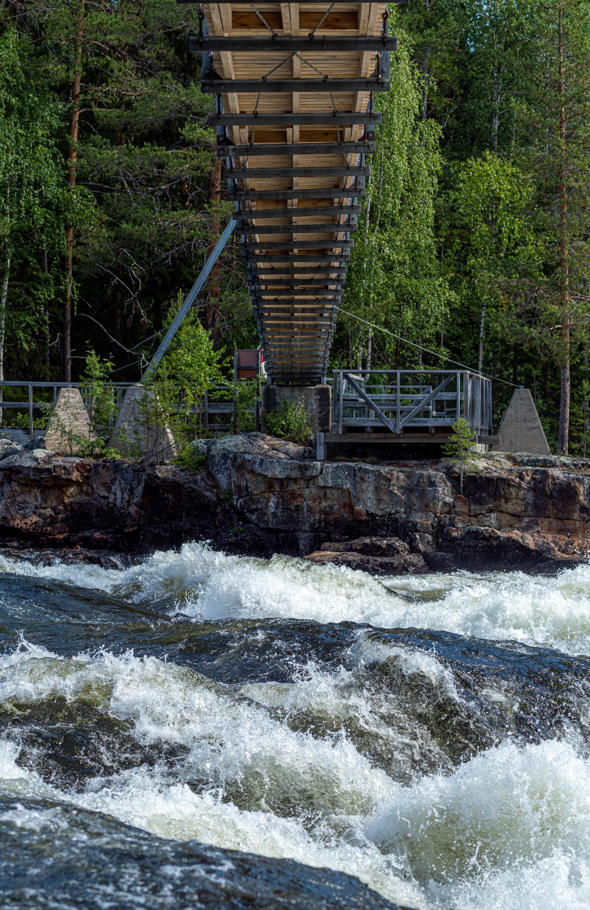
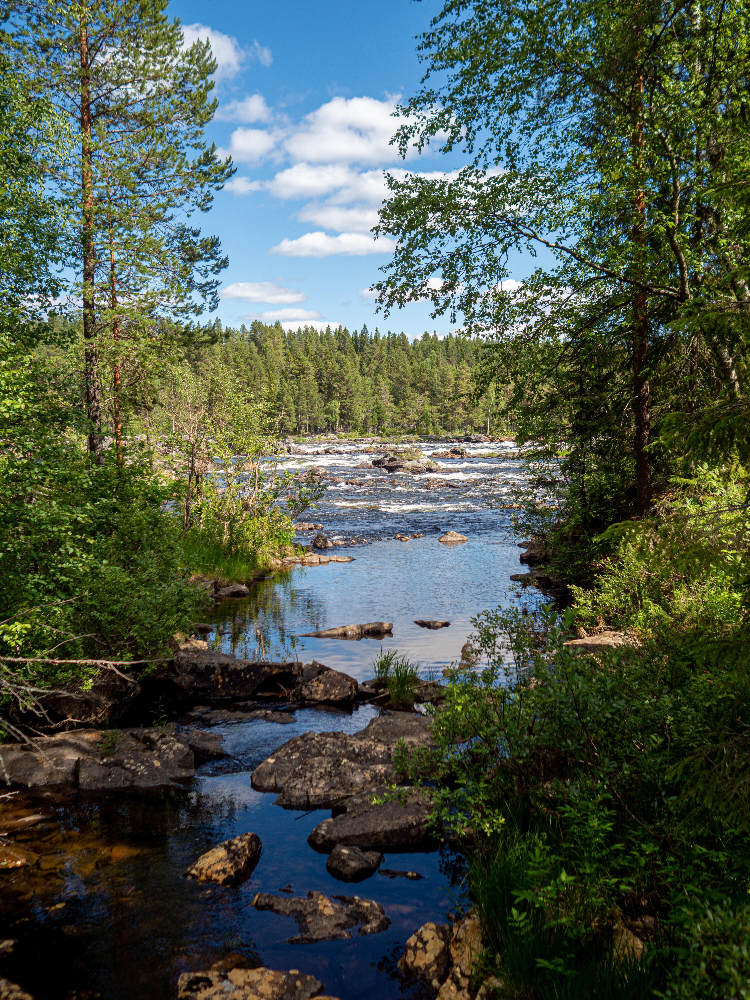
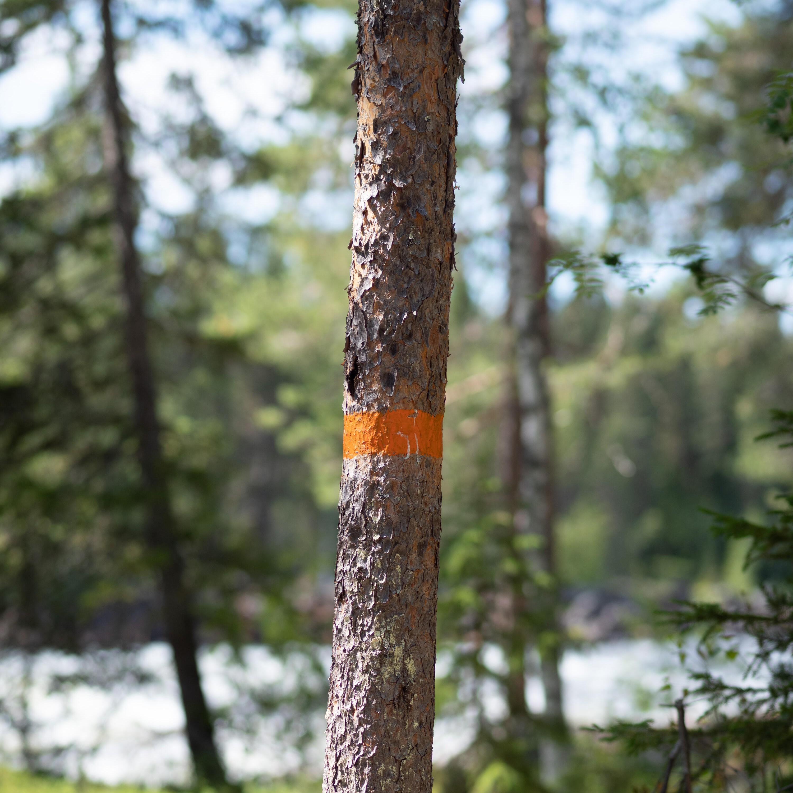
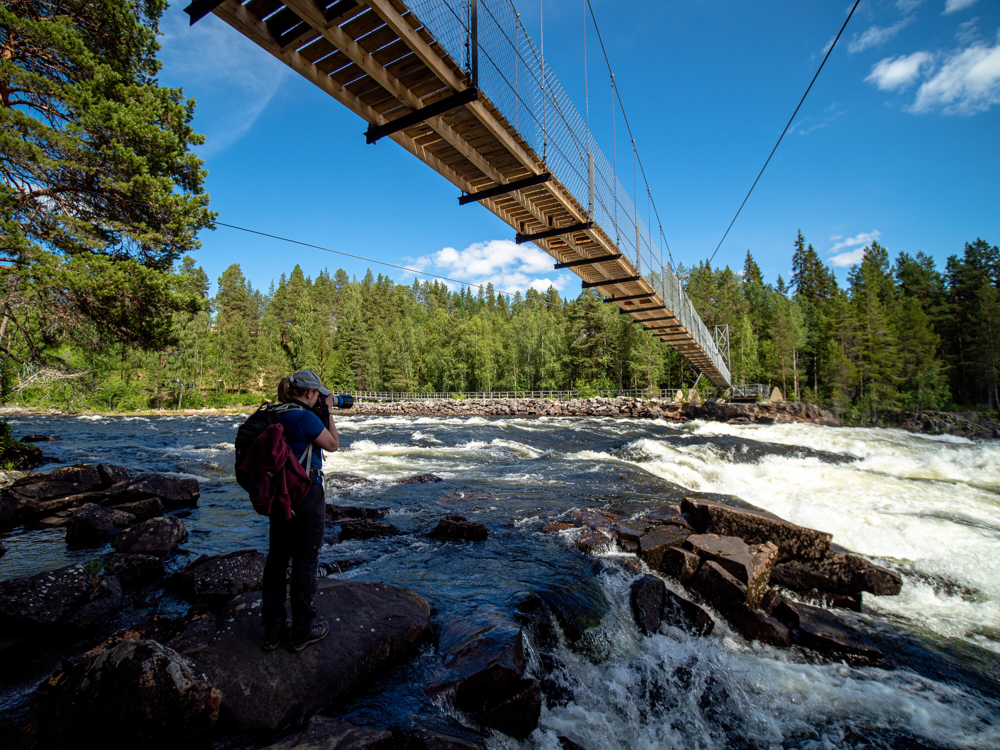

Om man är i närheten av Mårdselforsen så är ett besök obligatoriskt, så även denna resa. Eftersom vädret såg ut att bli regnigt resten av veckan bestämde vi oss för Mårdselforsen först.{.lead}

{.-full}

Mårdselforsen är en liten bit av Vindelälven där de byggt broar över och lagt en kort rundslinga på som vi gick. Slingan går förbi delar av forsen som är väldigt mäktiga och några lugnare partier.

:::: gallery {.-wide}
::: row {.-no-wrap}
{.-inline}
{.-inline}
:::
::: row {.-no-wrap}
{.-inline}
{.-inline}
:::
::::

<figure class="embed video -wide">
    <iframe title="En film över Mårdselforsen sett från flera olika vinklar" src="https://video.gustavlindqvist.se/videos/embed/f7978313-beb3-4232-95bb-9984eed1f8e8?title=0&amp;warningTitle=0&amp;p2p=0" allowfullscreen="" sandbox="allow-same-origin allow-scripts allow-popups" width="560" height="315" frameborder="0"></iframe>
</figure>

{.-wide}