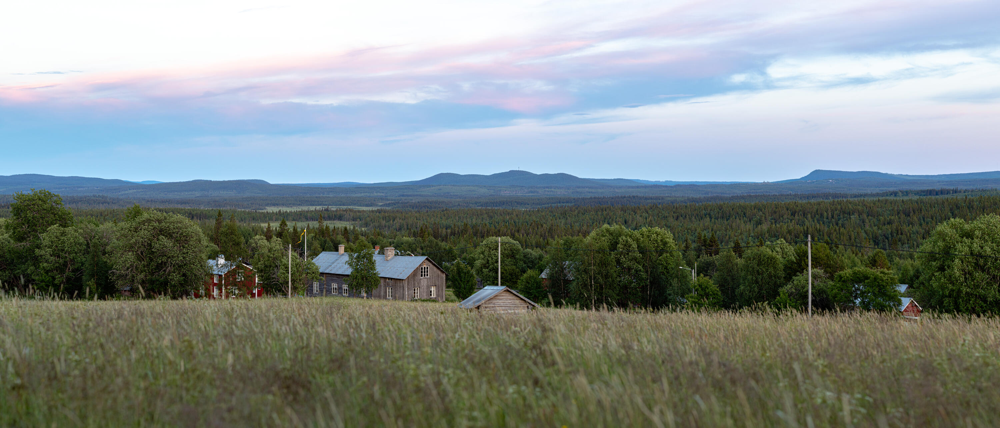
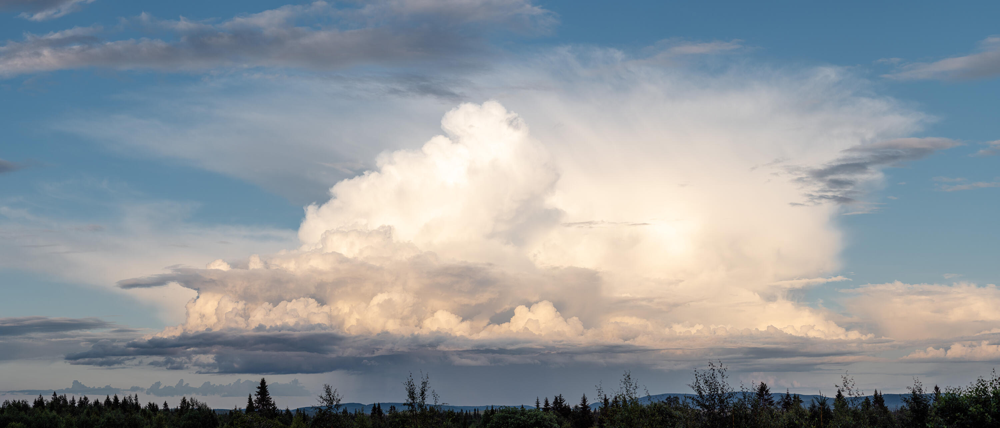
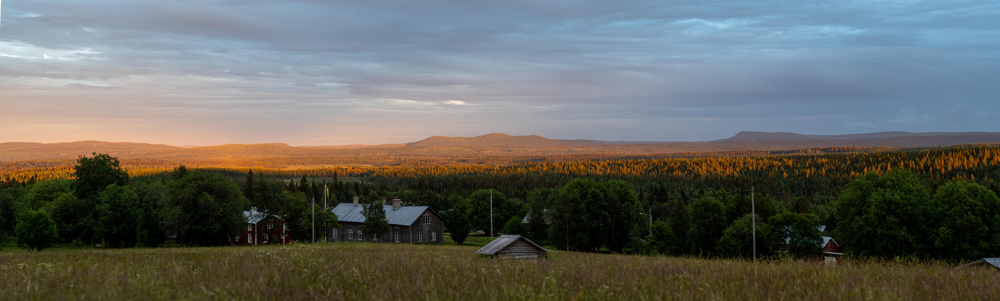

Under hela veckan vi var på Stöttingfjället var Fäboliden vår hemmabas. Det är en liten by utanför Lycksele med färre året-runtboende än jag har fingrar på en hand. Men några gånger på året så exploderar befolkningsmängden när släkt, vänner och andra besöker byn och omgivningen.{.lead}

Denna veckan var inte ett sådant tillfälle.

{.-full}

Fäboliden ligger på en höjd och har ett lokalt väderfenomen som gör att oväder ofta tar vägarna runt snarare än över, detta ger gott om möjligheter att fotografera dramatiska scener, oftast från högsta toppen av byn "oppa lia".

{.-full}

Runt 22:30 varje kväll innan solen gick ned bakom berget fanns en liten chans för att få se en liten dramatisk scen där landskapet badar i dagens sista ljus. I torsdags hade det varit mulet större delen av dagen och vi trodde det inte skulle bli något. Tjugo över 10 noterade Josefine att det lyste orange ute, så vi slängde oss in i bilen och körde snabbt upp mot "oppa lia" för att kanske få det hela på bild, och så blev det.

{.-full}

Utan tvekan resans bästa bild, och allt vi behövde göra var att vara på rätt plats på rätt tidpunkt. Fotografering är ganska häftigt ibland.