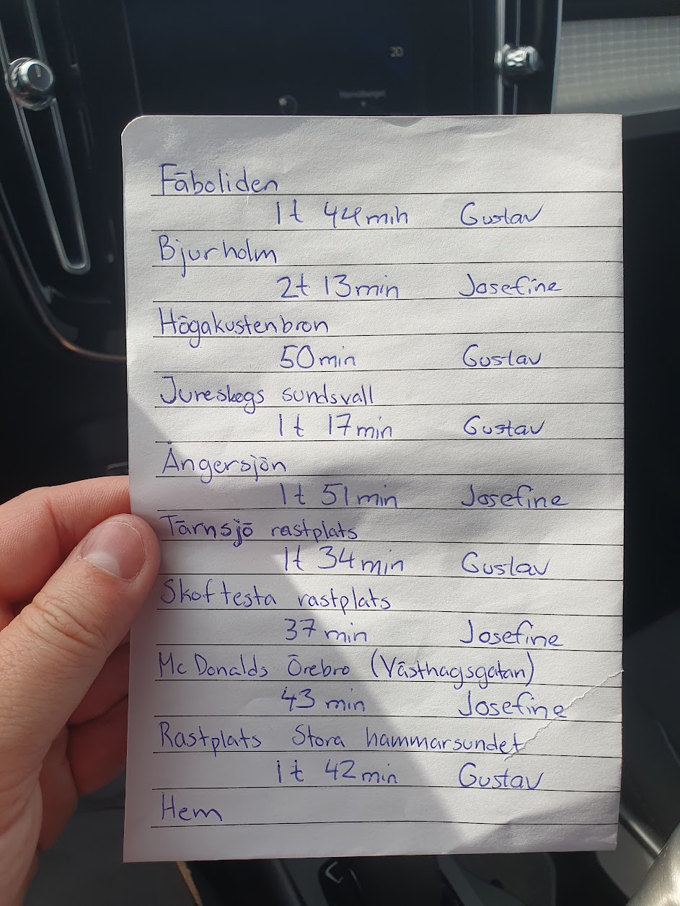
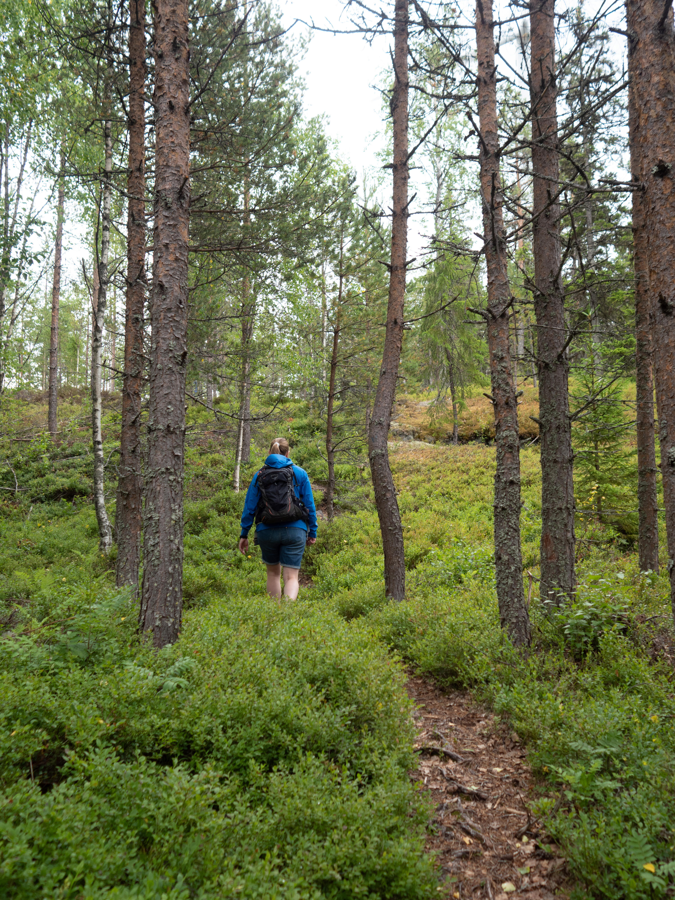
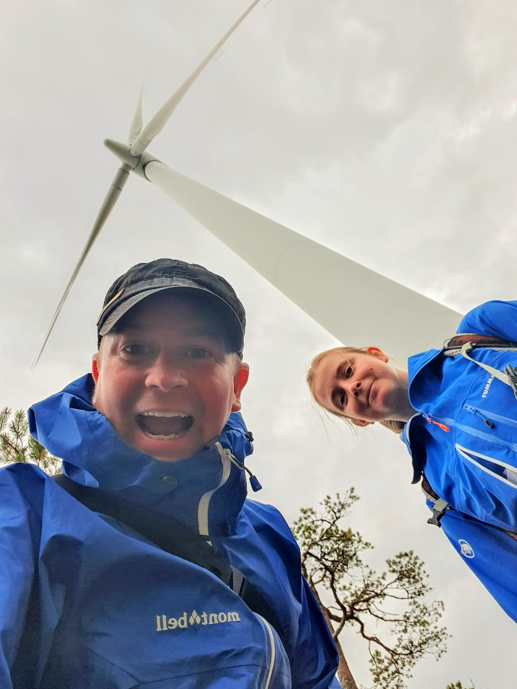
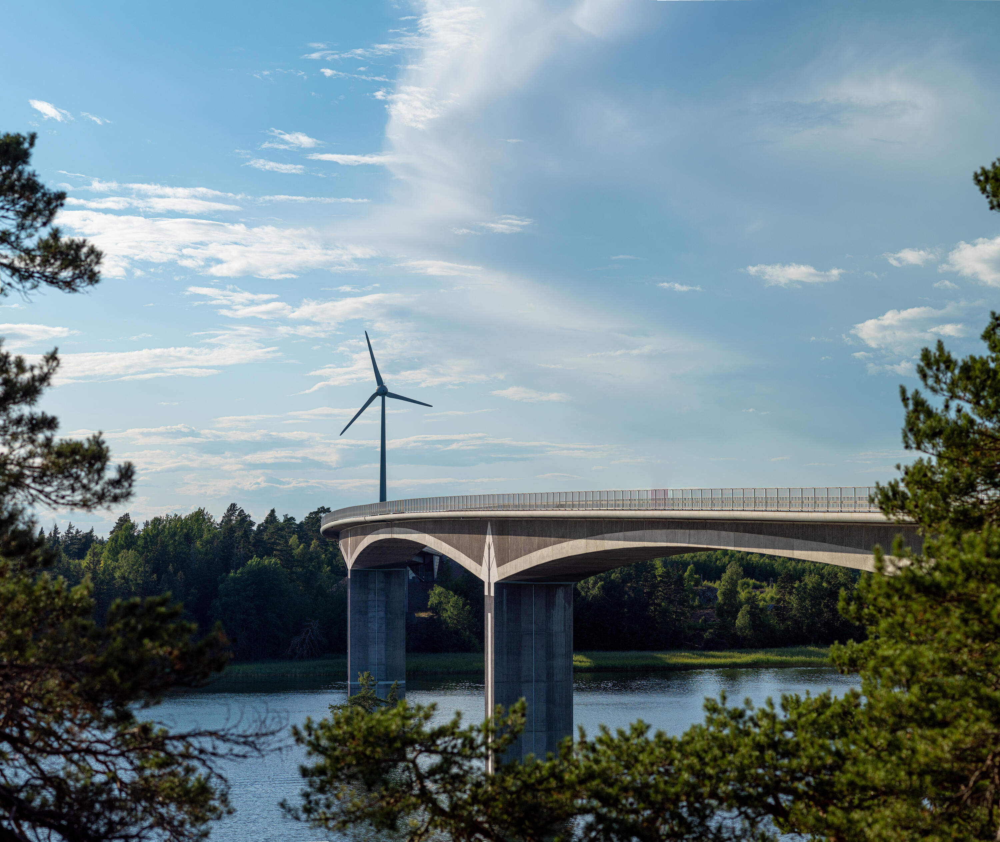

Från början var vi överens om att vi ville hem så fort som möjligt och då är det bästa alternativet att köra hela resan på en dag, lite mer än 1 000 km. Josefine hade kört hela sträckan tidigare men det var en ny utmaning för mig.

Vi rullade iväg innan klockan 6 på morgonen. Bilen var redan packad sen kvällen innan så vi skulle bara vakna, borsta tänderna och packa in sovgrejerna för att komma iväg. Sist Josefine kört sträckan så kom de inte iväg förrän runt halv nio. Denna gången hade vi kommit till Höga kusten när klockan var så mycket.

Eftersom vi kom iväg så tidigt kunde vi kosta på oss några lite längre stopp, Höga kustenbron var ett av dem. När vi körde upp hade vi sett ett vindkraftverk lite längre upp på toppen, ingen av oss hade stått under ett sådan förut så vi begav oss upp.

:::: gallery {.-wide}
::: row {.-no-wrap}
{.-inline}
{.-inline}
:::
::::

Långt mycket längre söderut blev det ytterligare ett stopp vid ännu en bro. Denna gången blev det Stora Hammarsundet.

{.-wide}

Lite efter klockan 9 på kvällen rullade vi in i Jönköping med en stor längtan efter att få träffa katterna efter en vecka borta.