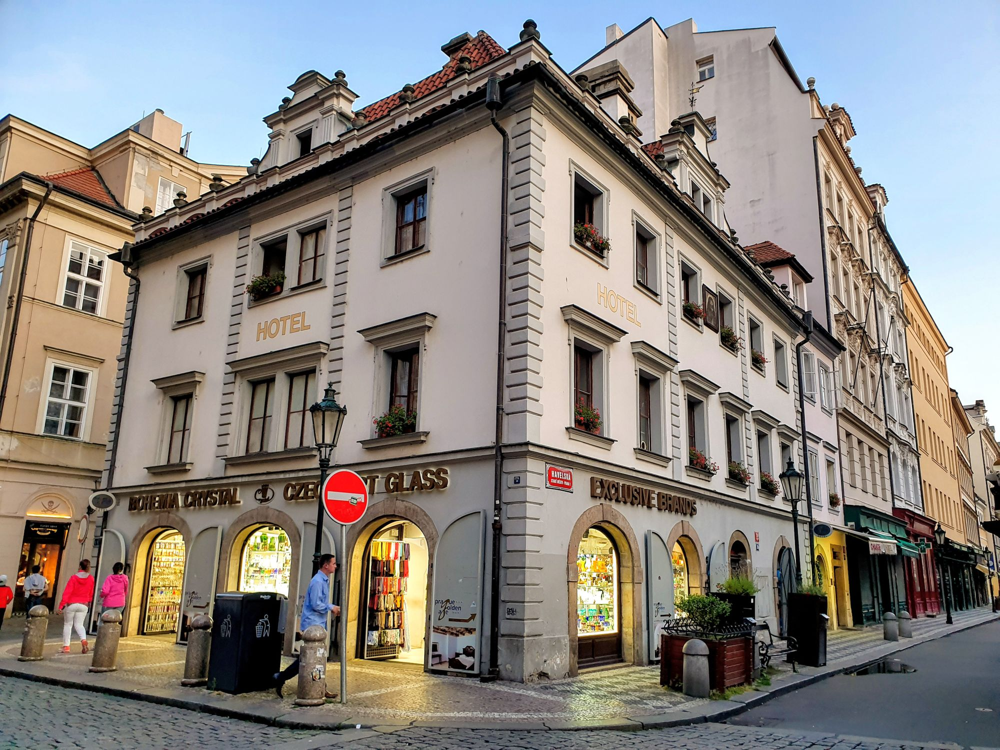
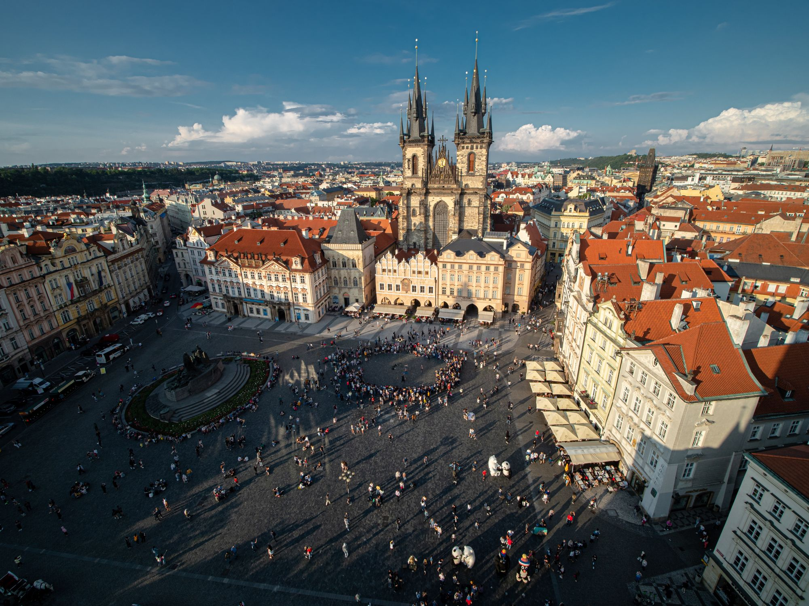
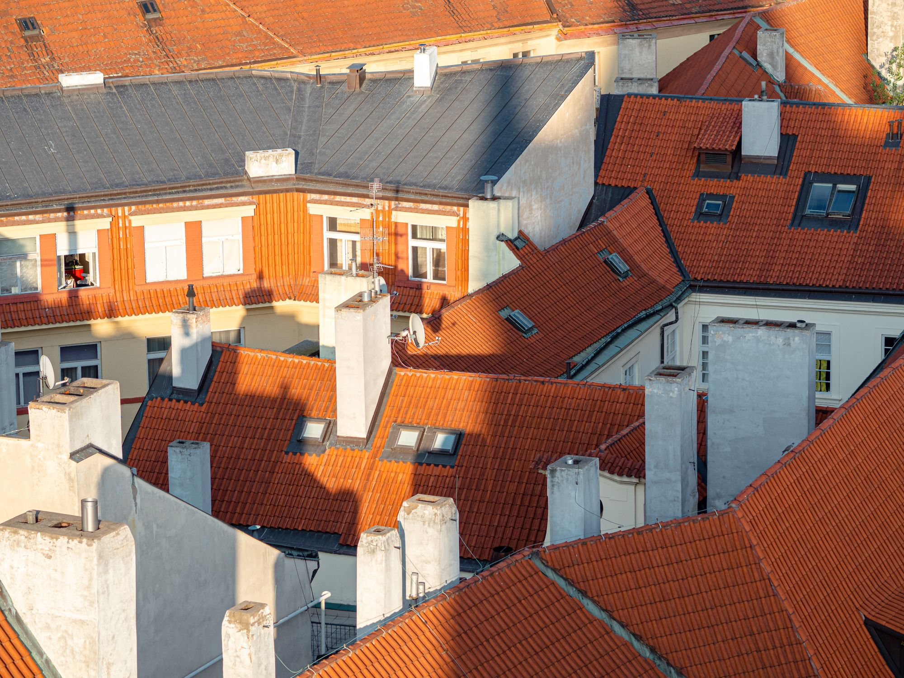
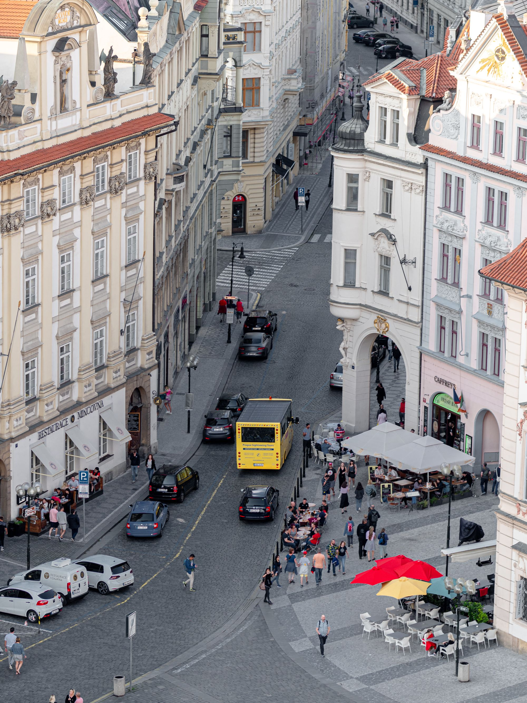
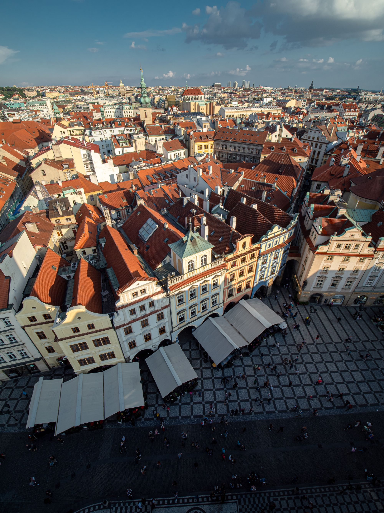
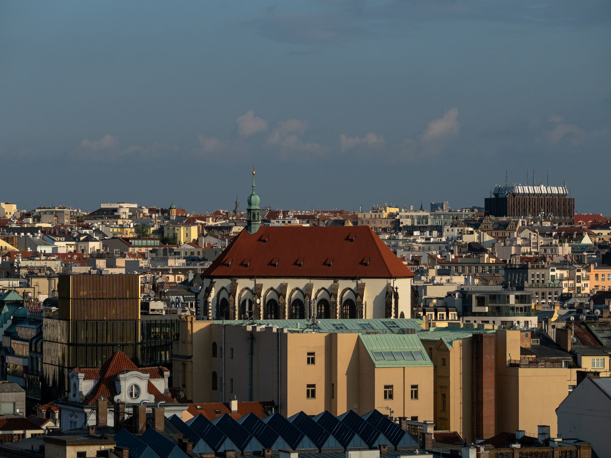
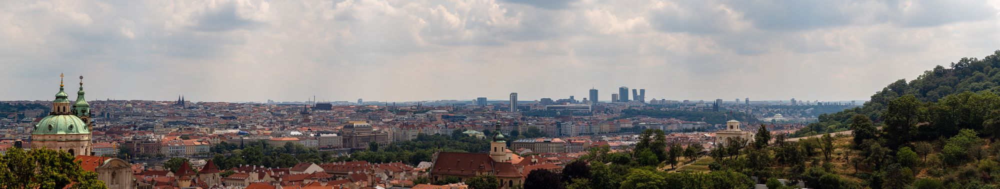
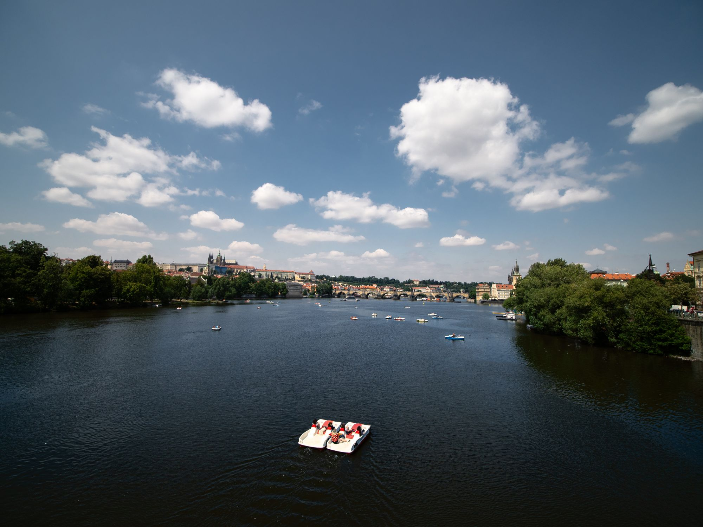
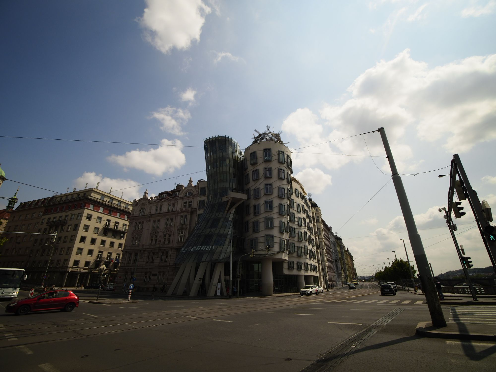

Första resan som kändes som tågluff på riktigt. Under de första två timmarna på tågresan mellan Berlin och Prag fick vi sitta på golvet ute i korridoren.

I Dresden var det två som hoppade av och öppnade upp två säten i en hytt som vi snabbt norpade. Resten av resan var sedan olidligt bekväm i jämförelse med att sitta på golvet.

Väl framme i Prag möttes vi av tungt regn som lyckligtvis snabbt avtog.

I Prag var vi i två dagar så vi lyckades se allt vi ville. Först ut var Old Town Hall som vi klättrade längst upp på.

{.-full}

:::: gallery {.-wide}
::: row
{.-inline}
{.-inline}
{.-inline}
:::
::: row
{.-inline}
{.-inline}
:::
::::

Därefter blev det fokus på att hitta en restaurang för middag. Efter lite sökande hittade vi en trevlig liten pizzeria i närheten av turiststråken.

## Dag två i Prag

Måndagen började vi med att fixa platsbokning till tåget ner mot Linz för att undvika att behöva sitta på golvet den sträckan.

Därefter tog vi oss till tunnelbanan för att ta oss upp mot Prags borg.

{.-wide}

Det mesta på borgen var fullproppat med folk och krävde inträde så vi nöjde oss med lite bilder utifrån och på utsikten innan vi gick ned från berget.

{.-full}

Från Kampaparken fick vi fina vyer över floden och Karlsbron.

:::: gallery {.-wide}
::: row
{.-inline}
{.-inline}
{.-inline}
:::
::::

{.-full}

Sedan gick vi ner till det dansande huset som Josefine ville se... Det var inte mycket att hänga i granen.

Kvällen avslutades med middag på restaurang följt av huvudnumret med ölprovning på Ú Kunštátů, en mysigt ölställe som ligger på en liten innergård.

")

I morgon (tisdag) åker vi vidare mot Linz och sen nattåg som är framme onsdag morgon i Venedig.
