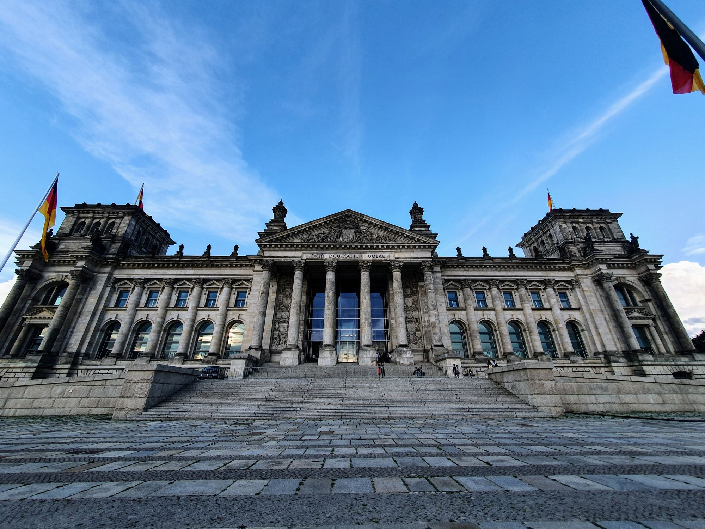

Resan från Rostock till Berlin klaffade perfekt med alla sträckor. Vi kom fram till Rostock drygt en timme före tåget skulle åka från stationen och tack vare två andra svenskar och två schweizare som vi delade en taxi med så hamnar vi med det tidiga tåget med drygt en kvarts marginal.{.lead}

Tågresan gick helt utan konstigheter och nu vet vi att interrail-biljetterna fungerar som de ska!

Vi anlände i Berlin 17:14 som gav oss flera timmar att gå runt i stan efter att vi checkat in på vårt hotell.

Det blev en runda bort till ett matställe och sen bort till Brandenburger Tor.

{.-wide}

Sedan gick vi en trevlig promenad runt parlamentsbyggnaderna och vattnet.

:::: gallery {.-wide}
::: row
{.-inline}
{.-inline}
:::
::: row
{.-inline}
{.-inline}
:::
::::

Kvällen avslutades med lite öl på en mysig restaurang på en innergård ett halvt kvarter från hotellet.
