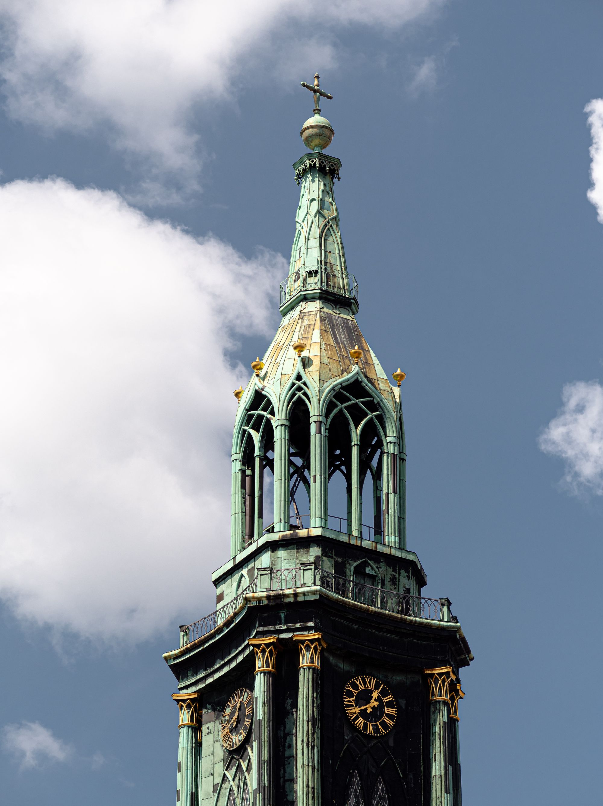
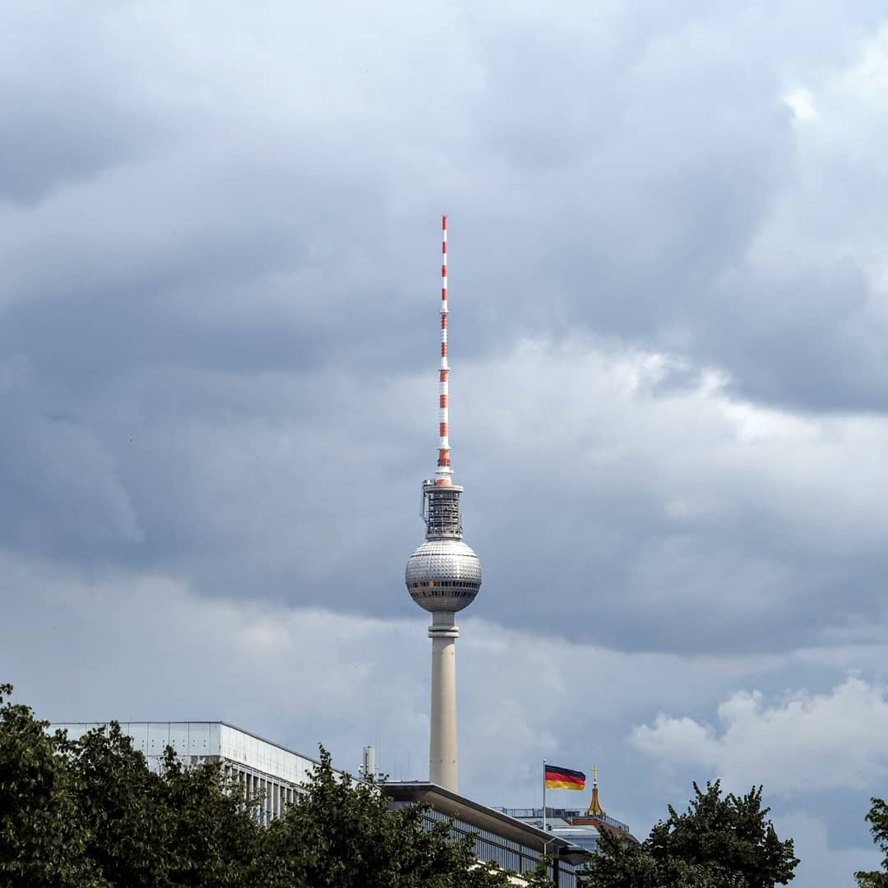
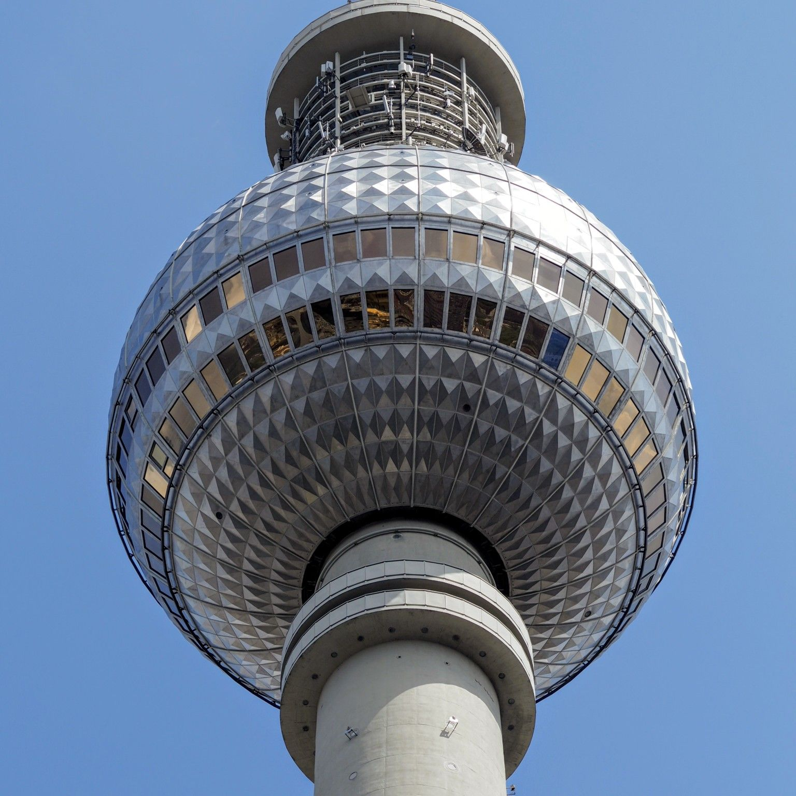

Andra dagen i Berlin började med en trevlig frukost på hotellet och sen en promenad bort till DDR-museet som låg precis intill Berliner Dom.

:::: gallery {.-wide}
::: row
{.-inline}
{.-inline}
:::
::: row
{.-inline}
:::
::::

Museet var väldigt intressant med en massa interaktiva moment som gav en inblick i livet i öst-Berlin från början till dess fall.

Därefter blev det ett besök på Decathlon som är en gigantisk sport- och friluftsaffär. Jag köpte ett par MTB-glasögon 😄.

:::: gallery {.-wide}
::: row
{.-inline}
:::
::: row
{.-inline}
{.-inline}
:::
::::

Sen gick vi bort till Brandenburger Tor och Tiergarten igen, denna gången för att besöka Förintelsemonumentet, som tillägnades de judar som mördades under andra världskriget, som ligger precis intill.

:::: gallery {.-wide}
::: row
{.-inline}
{.-inline}
:::
::::

Minnesmonumentet syftar till att "representera ett förmodligen ordnat system som har förlorat kontakten med mänsklig anledning" och var som ett stort rutnätverk av betongblock.

{.-full}

På kvällen blev det ett besök uppe i Fernsehturm 203 meter upp.

:::: gallery {.-wide}
::: row
{.-inline}
{.-inline}
{.-inline}
:::
::::

Dagen avslutade vi sen med en promenad bort till Berlin Wall Memorial.

:::: gallery {.-wide}
::: row
{.-inline}
{.-inline}
:::
::::

Efter DDR-museet på förmiddagen var det lite extra skrämmande att se muren på riktigt med vakttorn och allt.

I morgon (söndag) lämnar vi Tyskland och beger oss till Tjeckien och Prag.
