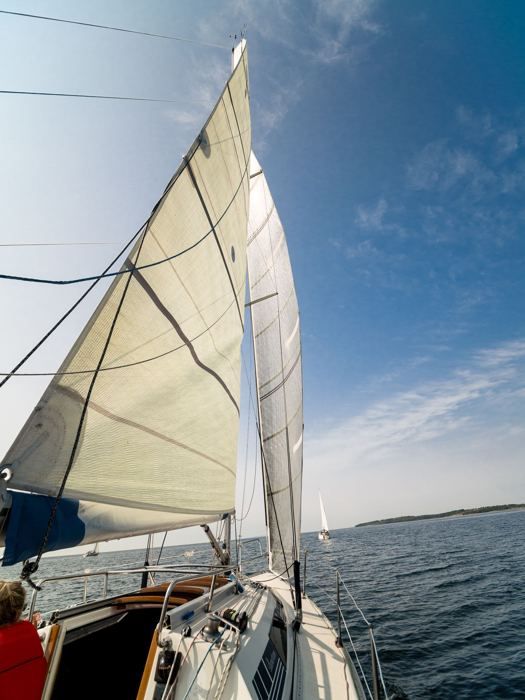
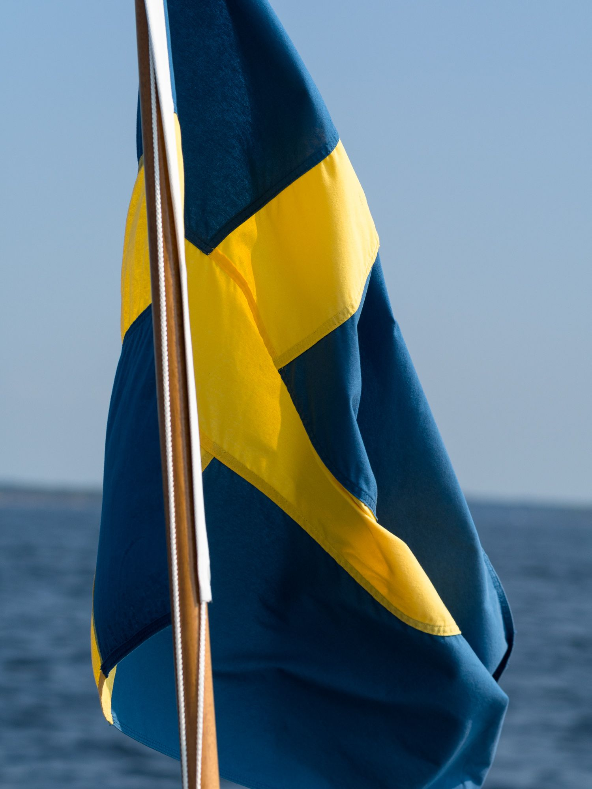
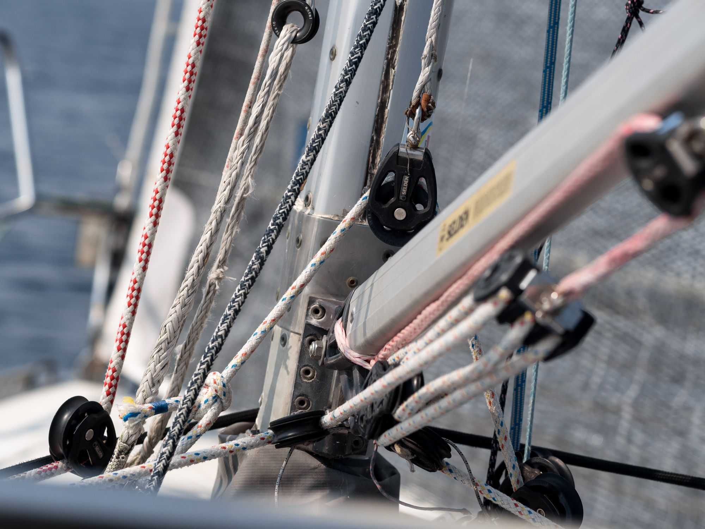
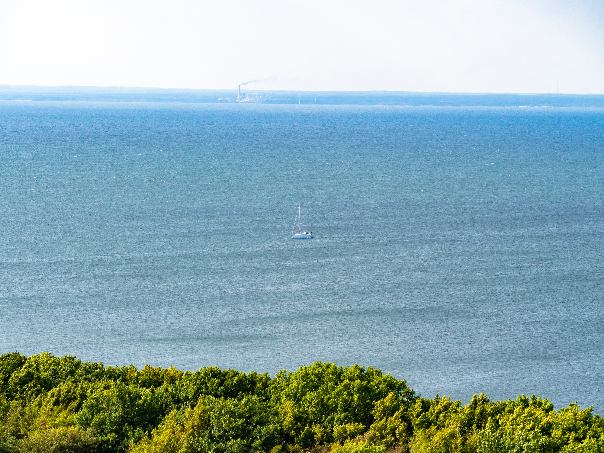
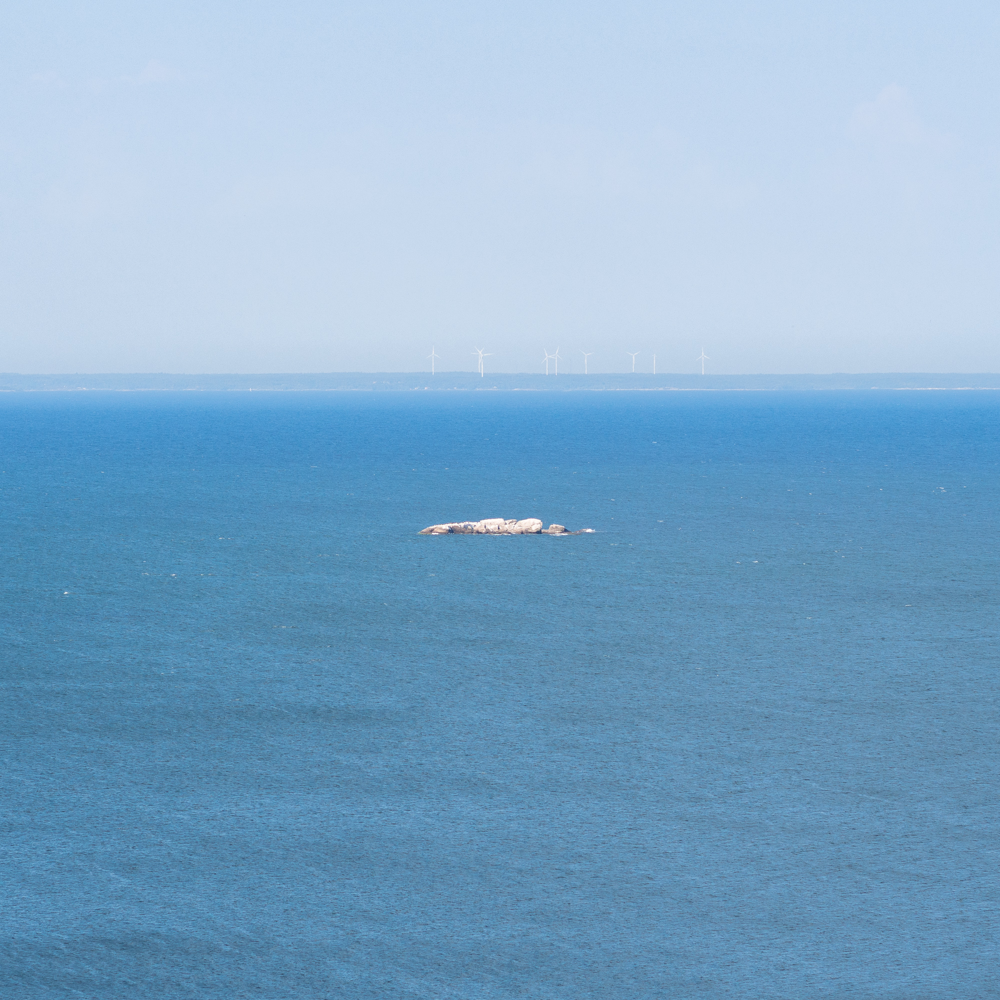
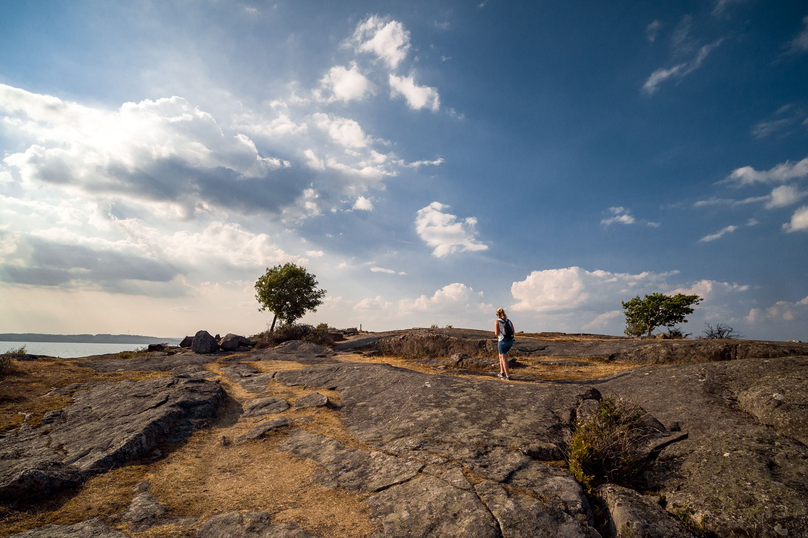
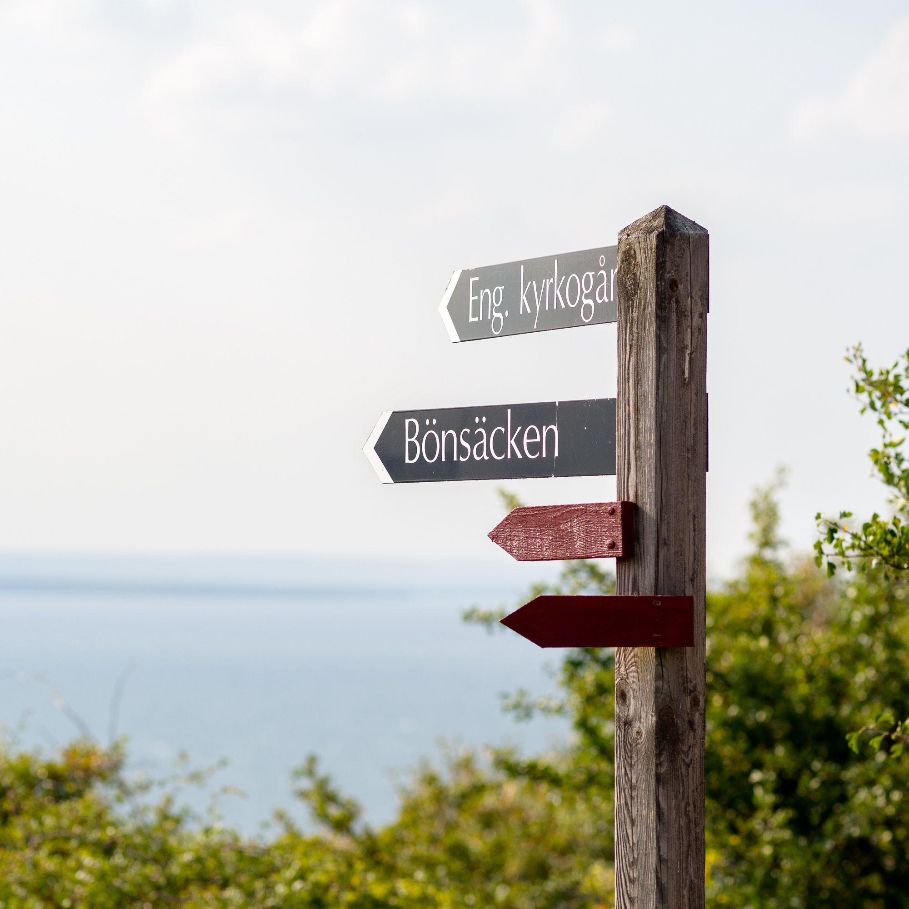
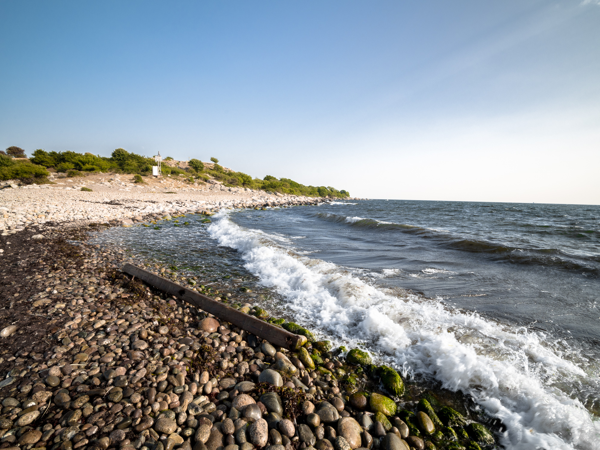
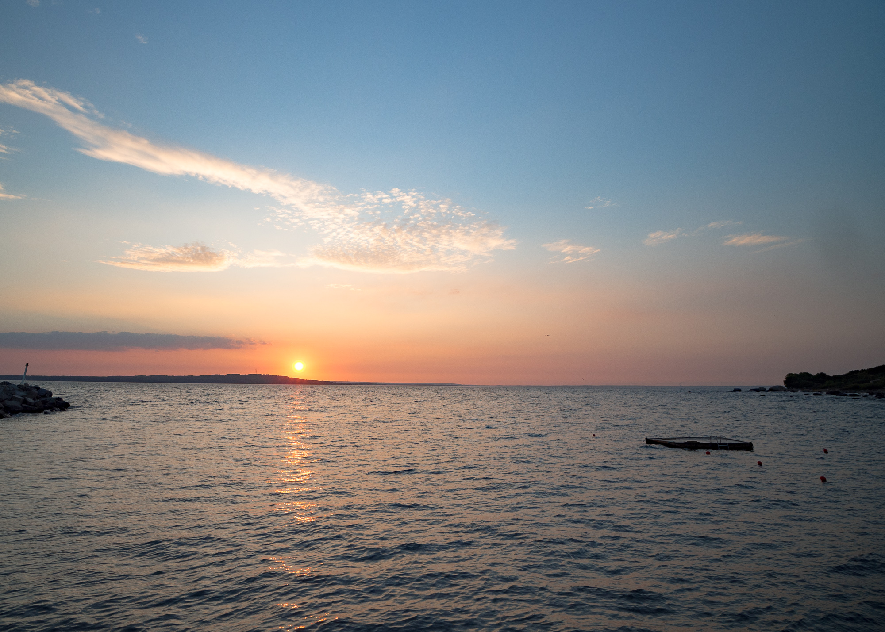

Nästa stopp var Hanö. Nu hade vi påbörjat seglatsen hemåt och då är det ett perfekt stopp innan seglatsen över Hanöbukten.{.lead}

Det var en kort men fin seglats ut från skärgården mot ön. Vi körde lite race mot några andra båtar, men de hade inte en chans.

Väl framme på Hanö är det obligatoriskt med en rundtur upp till toppen för den fina utsikten.

:::: gallery {.-wide}
::: row
{.-inline}
{.-inline}
:::
::: row
{.-inline}
{.-inline}
:::
::::

{.-full}

Sen gick vi ner mot Bönsäcken, en fin liten spets på den norra delen av ön.

:::: gallery {.-wide}
::: row
{.-inline}
{.-inline}
{.-inline}
:::
::::

{.-full}

{.-wide}

Dagen avslutades med en mycket mysig solnedgång.

{.-wide}

Några timmar senare gav vi oss iväg på första nattseglatsen för säsongen över Hanöbukten.
