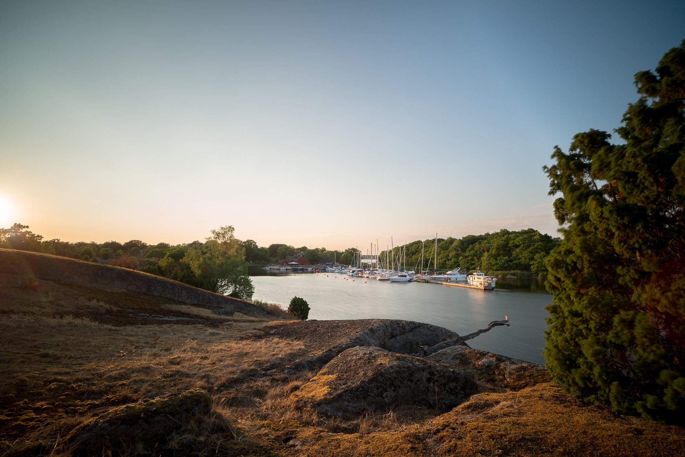
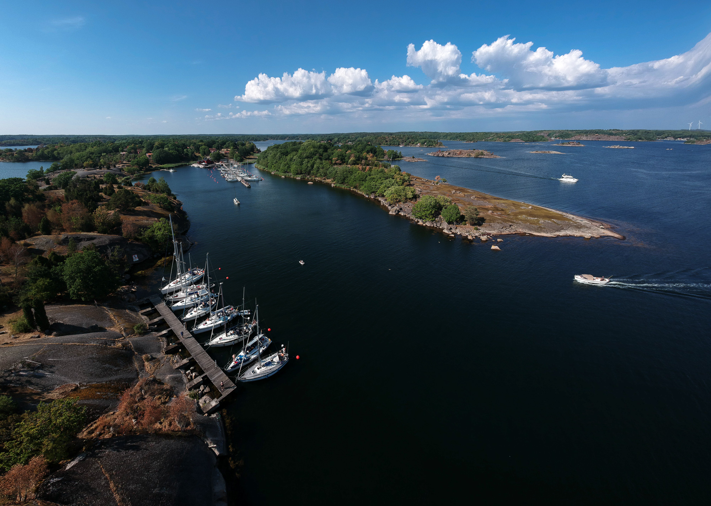
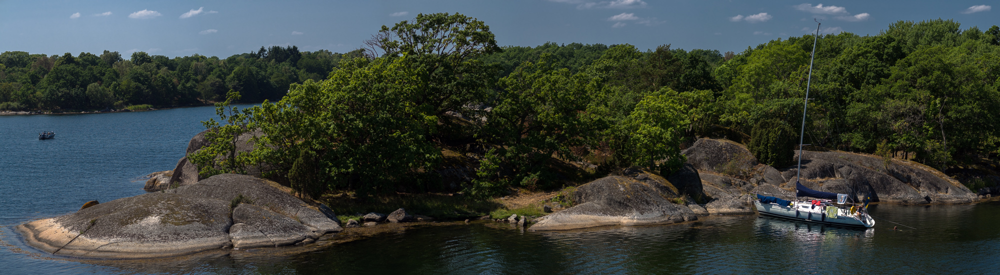

Tjärö har förändrats rejält genom åren efter att de gjort ett flertal ägarbyten. När jag växte upp besökte vi ofta Tjärö och då var det spartanskt men välskött av Svenska Turistföreningen. Efter en period [mellan 2008 och 2017 var det tumult och problem på ön](http://www.blt.se/karlshamn/gamla-agarna-ar-tillbaka-pa-tjaro/) där i stort sett allt förföll har nu ön kommit tillbaka i helt ny tappning.

Filmen nedan av Chani Johnsson visar hur det nya fina restaurangkomplexet ser ut. Med möjligheter att få mat, dryck och fika.

<figure class="embed video -wide"> <iframe width="480" height="270" src="https://www.youtube-nocookie.com/embed/RHPMO2EOqQ4?feature=oembed" frameborder="0" allow="accelerometer; autoplay; encrypted-media; gyroscope; picture-in-picture" allowfullscreen></iframe></figure>

Även jag saknar det gamla Tjärö så är allt bättre än vad det var åren efter 2008.

På kvällen fick jag många fina möjligheter att prova [mitt nya objektiv](/2018/07/14/nytt-supervidvinkelobjektiv/) när vi gick runt och fotograferade.

{.-wide}

På vår runda hittade jag ett riktigt häftigt träd som ljuset föll genom på ett helt magiskt sätt. Trots torkan och att nästan allt gräs var halvdött blev det fantastiska färger.

{.-wide}

Det fina vädret passade även perfekt för flygning så jag passade på att lyfta med drönaren och ta lite bilder över skärgården.

{.-full}

Dagen efter valde vi att gå en bit bort till naturhamnen på Dragsö som ligger runt hörnet. På vägen dit passerade vi en av de många passagerna [där deltagarna i Island Challenge Swimrun simmade mellan öarna](http://islandchallenge.se/). Lyckligtvis kom vi precis efter att de sista hade passerat så vi slapp vänta.

{.-full}
