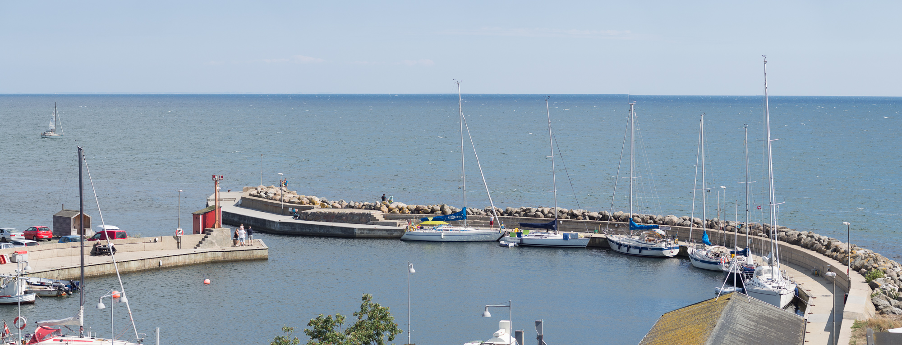
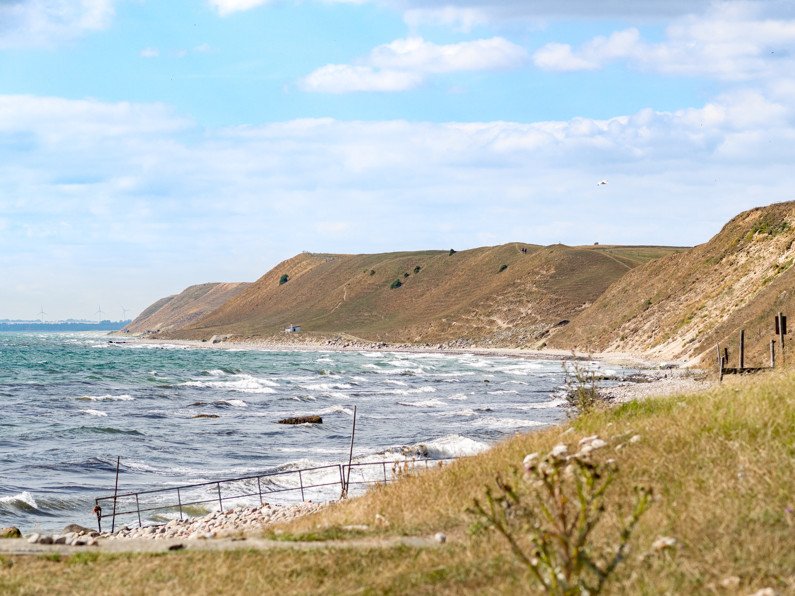
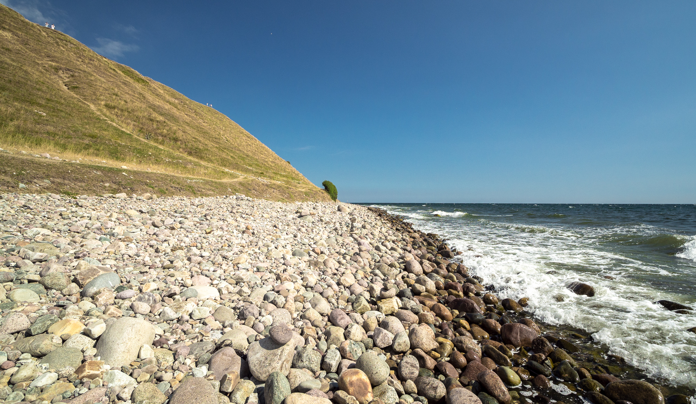

Resan ner blev lugn utan vare sig vågor eller vind. Enda seglet som var hissat var järngenoan (motorn).

"){.-wide}

Tidig förmiddag kom vi fram till Kåseberga.

{.-full}

Nån timme efter att vi kommit fram blåste det upp rejält, väderleksprognoserna lovade kraftiga vindar dagtid och lugnt nattetid. Så vi bestämde oss för att vila upp oss efter nattens eskapader och invänta lugnare väder.

{.-wide}

Jossan och jag gick en runda upp till Ales stenar som var fullproppat med folk och klättrade (gled) nedför branten mot stranden.

{.-wide}

Efter lite mat i magen kastade vi loss för den sista biten mot Trelleborg och hemmahamnen.

Första biten utmed Ystads kust gick vi för segel. När sedan solen gick ner försvann även vinden så det blev motor resten.

01:00 avslutade vi seglatsen när vi anlände hemmahamnen Gislövs läge.
