Det har varit några år sedan jag byggde min förra dator, 5 år för att vara mer exakt, så det är på tiden att det blir något nytt.

I samband med studierna har spelintresset fallit åt sidan, detta samtidigt som det finns ett flertal spel som jag gärna skulle vilja börja på. Jag vill dock inte behöva sänka grafiken för att kunna köra spelen. De ska spelas så som utvecklarna har menat att de ska spelas, på max! 😄

Därför har listan av spel som jag vill spela växt och växt. GTA V, Dragon Age Inquisition, Assassin's Creed Unity och många fler...

Så de senaste åren har jag ganska naturligt spelat spel som har fungerat på min laptop eller min smartphone. Spel som Terraria, FTL: Faster Than Light!, Pillars of Eternity men även mobilspel och emulatorer via mycket trevliga gameaden MOGA Controller. Kort och gott, spel som kräver mindre men samtidigt är riktigt bra spel 😄

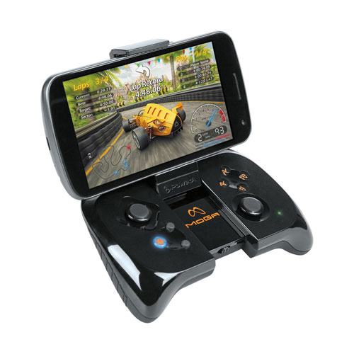{.-inline}

# Bygget

Jag ville bygga något speciellt, Torn är så tråkiga att bygga i eftersom allt får plats, oavsett vad en väljer. Då hittade jag chassit Node 304 som bygger på moderkortsstorleken Mini ITX.

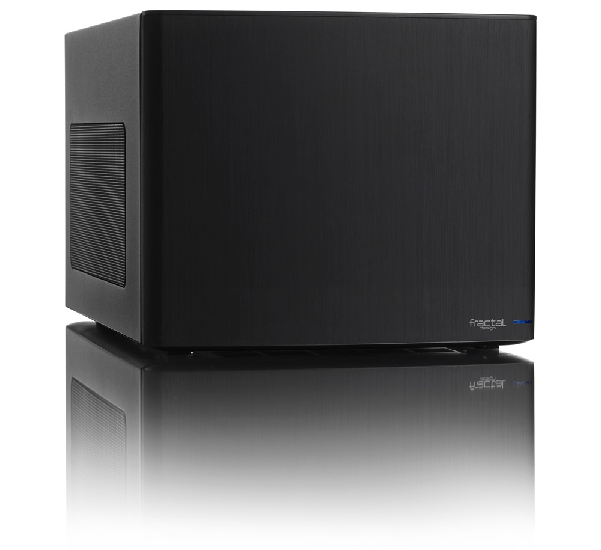

Jag gillar chassit delvis för att det är litet men även för att det är ganska diskret och inte lika flashigt som andra chassin normalt är utan kan smälta in i en kontorsmiljö. Samtidigt har den plats för fullstora grafikkort, ett rejält nätaggregat och flera hårddiskar, vilket var lite av ett krav eftersom jag tänkte bygga en dator som klarade av allt.

**Och sen tog projektet fart.**

> <table><tbody><tr><td><strong>Case</strong></td><td><a href="http://www.prisjakt.nu/produkt.php?p=1282732">Fractal Design Node 304</a></td></tr><tr><td><strong>Fläktar</strong></td><td><a href="http://www.prisjakt.nu/produkt.php?p=2009308">Noctua NF-A14 PWM 140mm</a> &amp; 2x <a href="http://www.prisjakt.nu/produkt.php?p=2897001">Noctua NF-A9 PWM 92mm</a></td></tr><tr><td><strong>PSU</strong></td><td><a href="http://www.prisjakt.nu/produkt.php?p=2160331">Cooler Master V650S Semi-Modular</a></td></tr><tr><td><strong>Moderkort</strong></td><td><a href="http://www.prisjakt.nu/produkt.php?p=3084217">ASRock X99E-ITX/ac</a></td></tr><tr><td><strong>CPU</strong></td><td><a href="http://www.prisjakt.nu/produkt.php?p=2782208">Intel Core i7-5820K 3,3GHz 6-Core Processor</a></td></tr><tr><td><strong>CPU-fläkt</strong></td><td><a href="http://www.prisjakt.nu/produkt.php?p=2009314">Noctua NH-U9DX i4</a></td></tr><tr><td><strong>RAM</strong></td><td><a href="http://www.prisjakt.nu/produkt.php?p=3054241">Kingston Fury HyperX 16GB (2x8GB) DDR4-2133</a></td></tr><tr><td><strong>GPU</strong></td><td><a href="http://www.prisjakt.nu/produkt.php?p=3169823">EVGA GeForce GX 980 Ti Superclocked+ ACX 2.0+</a></td></tr><tr><td><strong>Lagring</strong></td><td><a href="http://www.prisjakt.nu/produkt.php?p=2880210">Samsung 850 EVO 500GB</a> &amp; <a href="http://www.prisjakt.nu/produkt.php?p=2254629">Western Digital Black 4TB</a></td></tr></tbody></table>

## Chassi, moderkort, RAM & PSU

För att inte chocka kontona för mycket köpte jag de olika komponenterna i omgångar. Först ut var chassit. Delvis för att se var lådan kan stå men även för att börja planera bygget och ha möjlighet att mäta inuti chassit för att se om komponenterna får plats.

:::: gallery {.-wide}
::: row
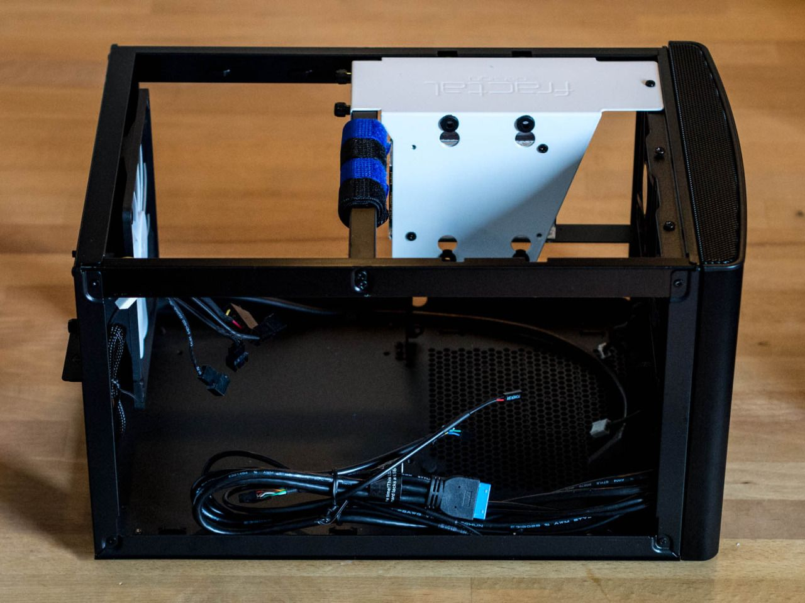{.-inline}
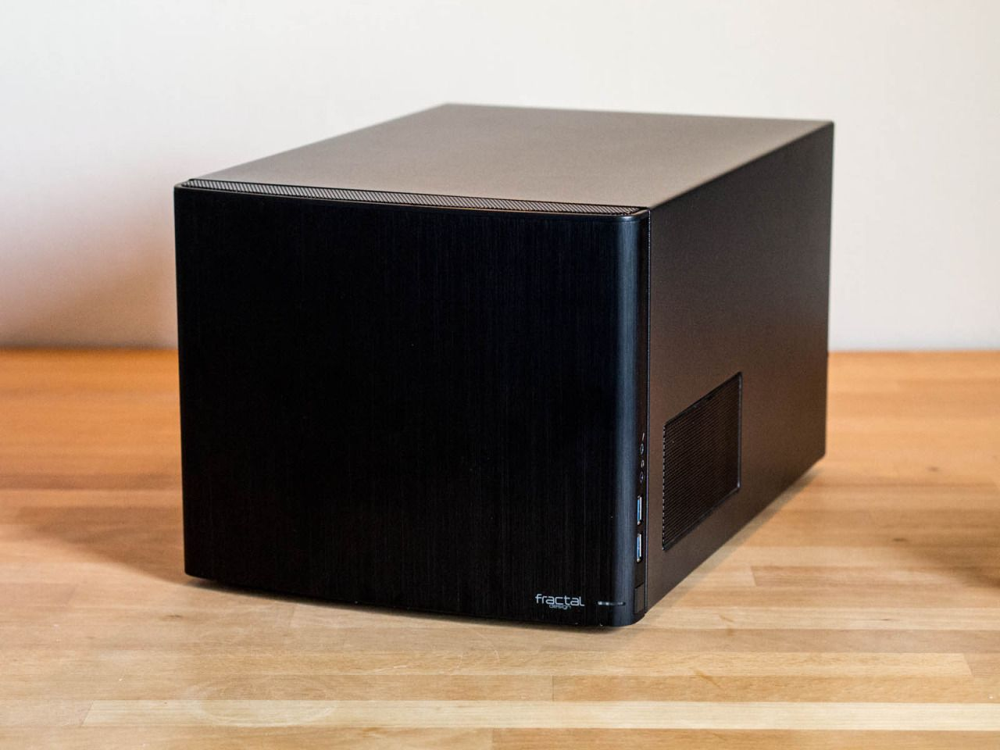{.-inline}
:::
::::

Därefter var det dags för moderkortet, RAM samt nätaggregatet. Moderkortet är nog det som är mest speciellt i hela bygget; Det var vid inköp det enda som hade stöd för DDR4 och hade den lite större processorsockeln 2011-3.

:::: gallery {.-wide}
::: row {.-no-wrap}
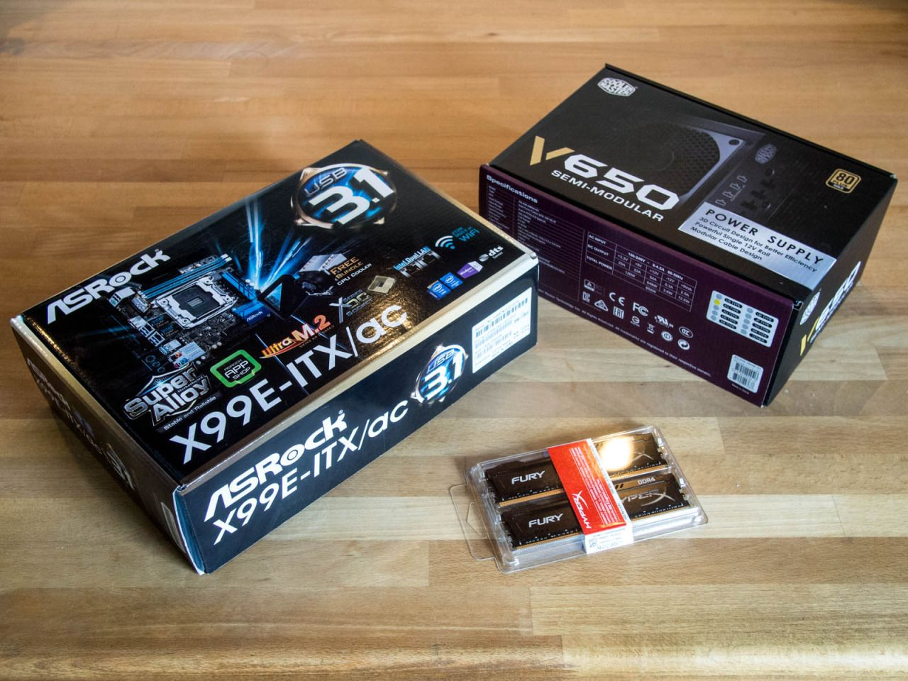{.-inline}
{.-inline}
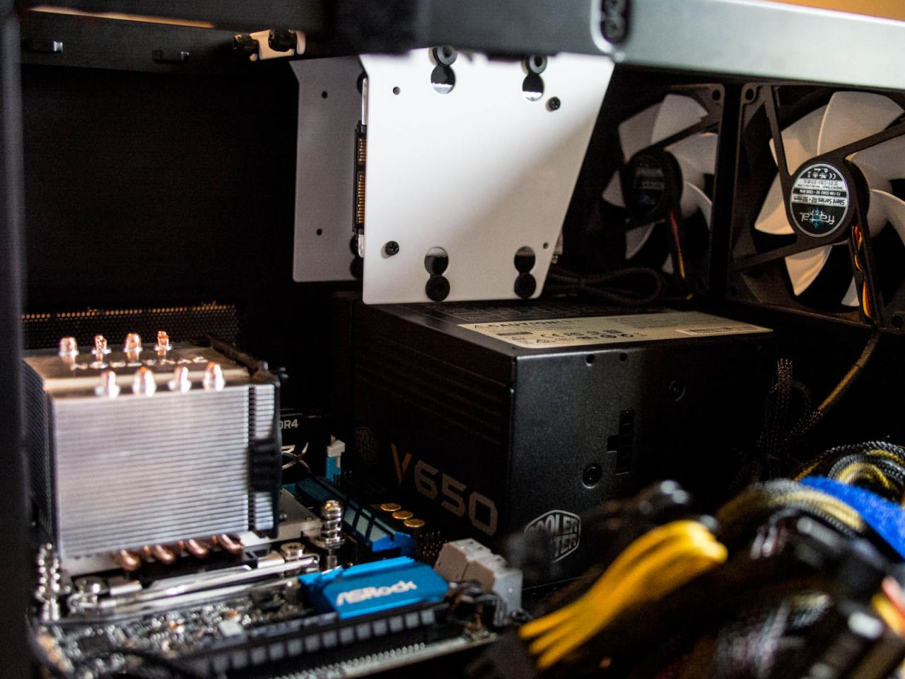{.-inline}
:::

::::

## CPU, GPU, SSD & HDD

I nästa steg var det dags att fixa processorn och lagring. Jag hittade en gammal HDD från min laptop som jag stoppade i så länge. Den är tanken att den ska bytas mot 4TB hårddisken nämnd i listan ovan.

Direkt när jag satte igång datorn reagerade jag på hur högljudda fläktarna som kom med var. Så jag beställde 3 st Noctua-fläktar som var tänkta att ersätta fläktarna som kom med chassit. Vid detta läget visste jag inte ens om datorn fungerade utöver att den bootade.

Det var inte förrän jag fick grafikkortet levererat som jag kunde få ut någon form av bild. Och allt fungerade som det skulle! :D

## Kylning

Ett av målen med datorn var att kunna ha mer än 16 GB trots Mini-ITX. Tyvärr fanns det endast 32GB (2x16GB) kit för servrar och inte specifikt för gaming när jag köpte delarna _(det fanns 128GB (8x16GB) av någon anledning)_. I skrivande stund finns ett flertal 2x16GB-kit som jag ska byta till vid något framtida tillfälle när jag känner ett behov.

Den enda Noctua-fläkten som är kompatibel med moderkortet är [Noctua NH-U9DX i4](http://www.prisjakt.nu/produkt.php?p=2009314), detta på grund av att RAM sitter på ett lite annorlunda ställe och moderkortet använder en s.k. _Narrow ILM_ 2011-3 socket för CPU. Däremot stod det i specifikationen att CPU-fläkten endast får plats om RAM är lägre än 32mm höga; Mina är 34mm.

En snabb googling visade att det var någon gjort egna mätningar och fått fram att upp till 35mm höga minnen får plats. Så jag slängde iväg en beställning.

Och mycket riktigt, fläkten gick in med drygt en millimeters marginal mot RAM. Dock blev det riktigt trångt mellan den stora chassifläkten och ena fläkten på den nya kylaren, men med lite våld fick jag alla fläktarna på plats.

:::: gallery {.-wide}
::: row
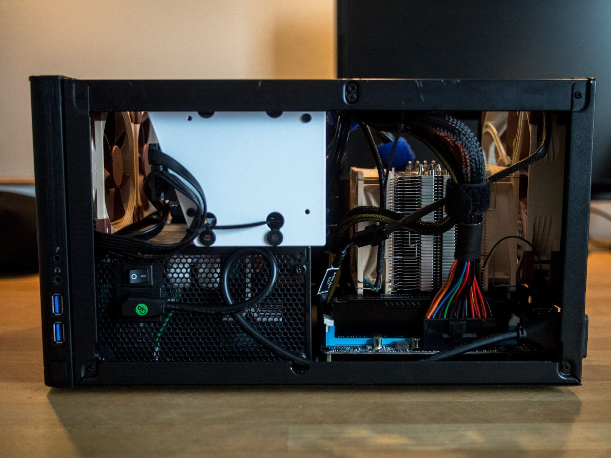{.-inline}
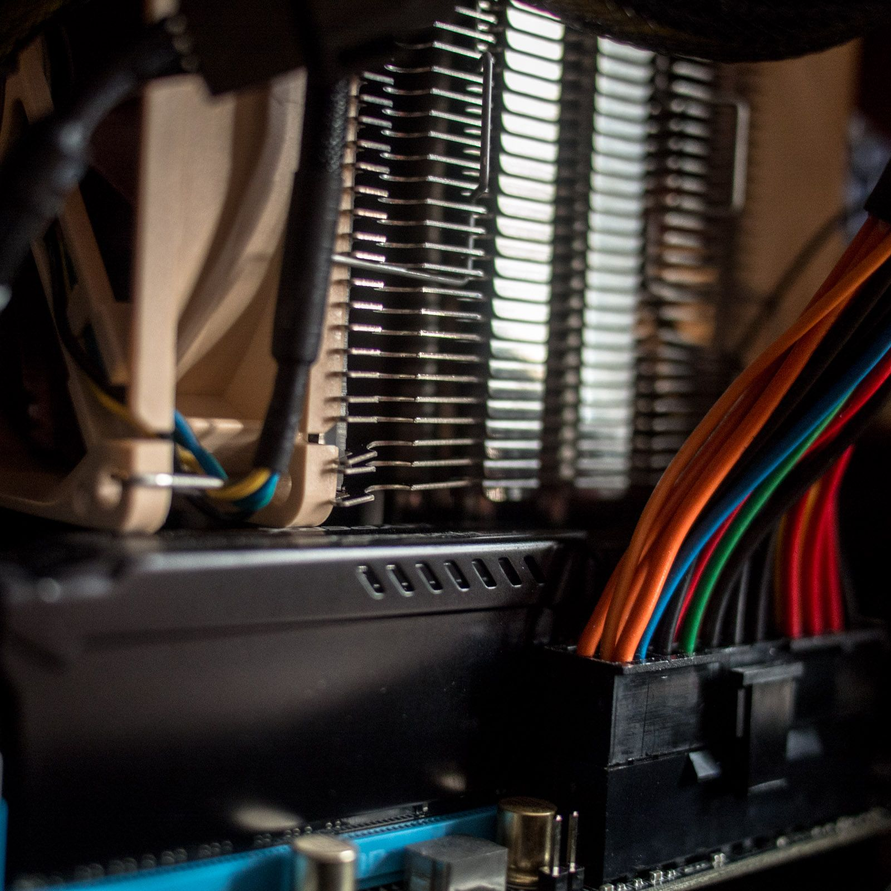{.-inline}
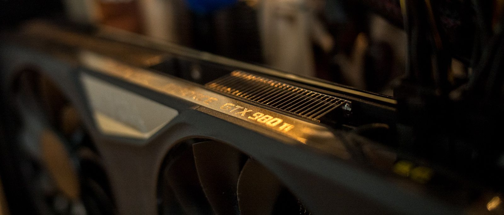{.-inline}
:::
::: row {.-no-wrap}
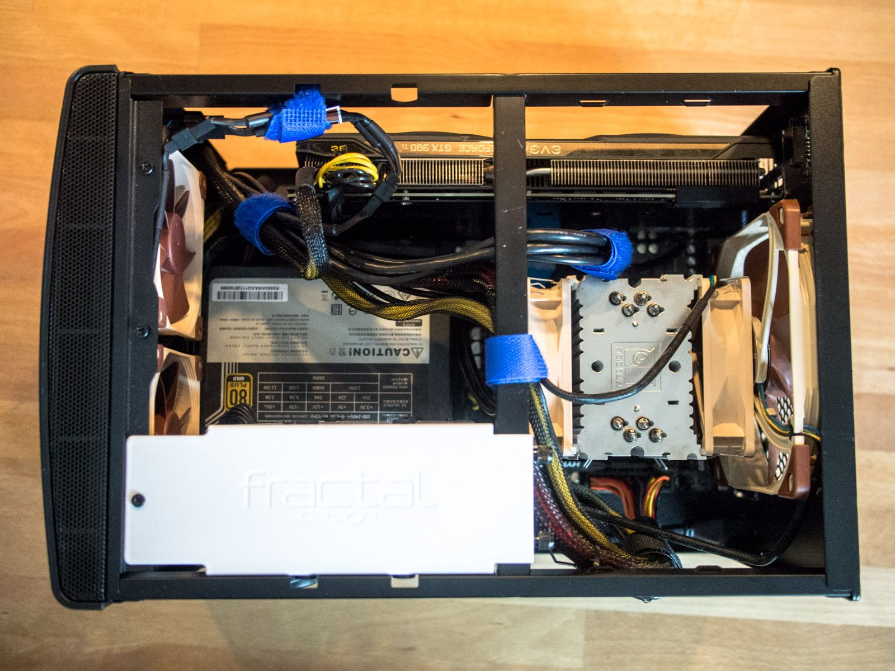{.-inline}
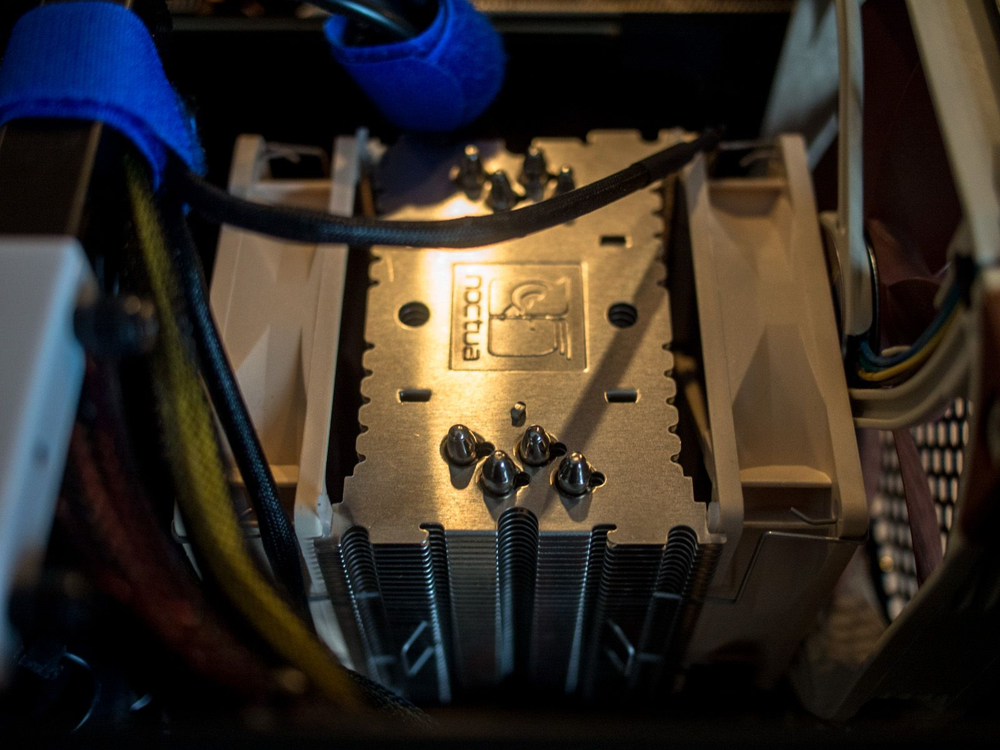{.-inline}
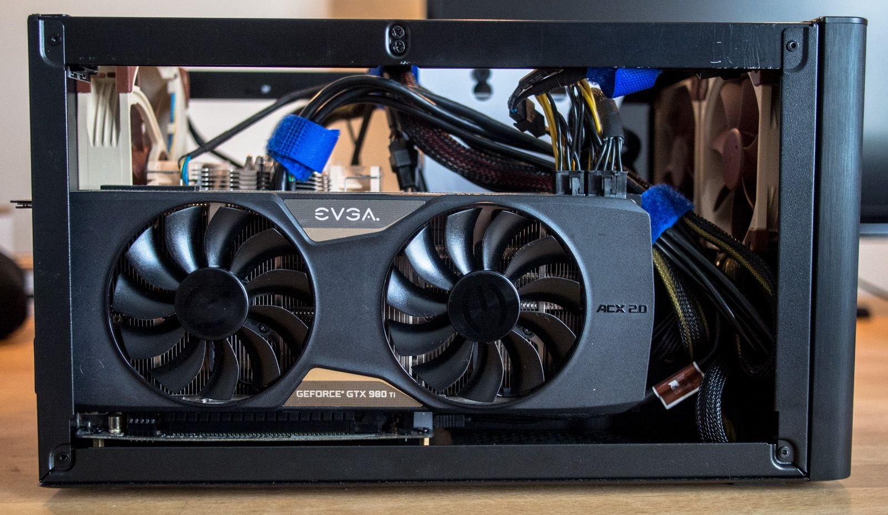{.-inline}
:::
::::

## Constructing My Battle Station

Har specifikt valt att inte fotografera min setup ännu eftersom den inte är färdig. Men tanken är att den ska bräcka min förra Battle Station _(Bild nedan)_.

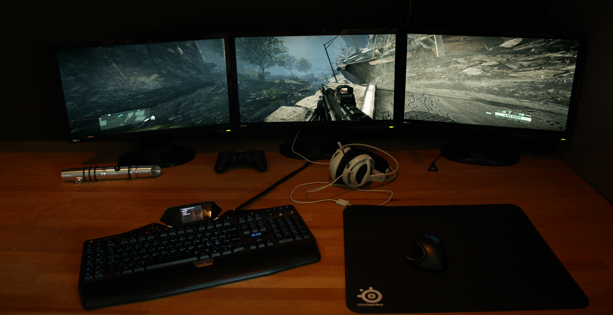{.-wide}

Kronjuvelen kommer förmodligen bli Acers nya 34" UltraWide, Acer Predator X34.

**To be continued...**
