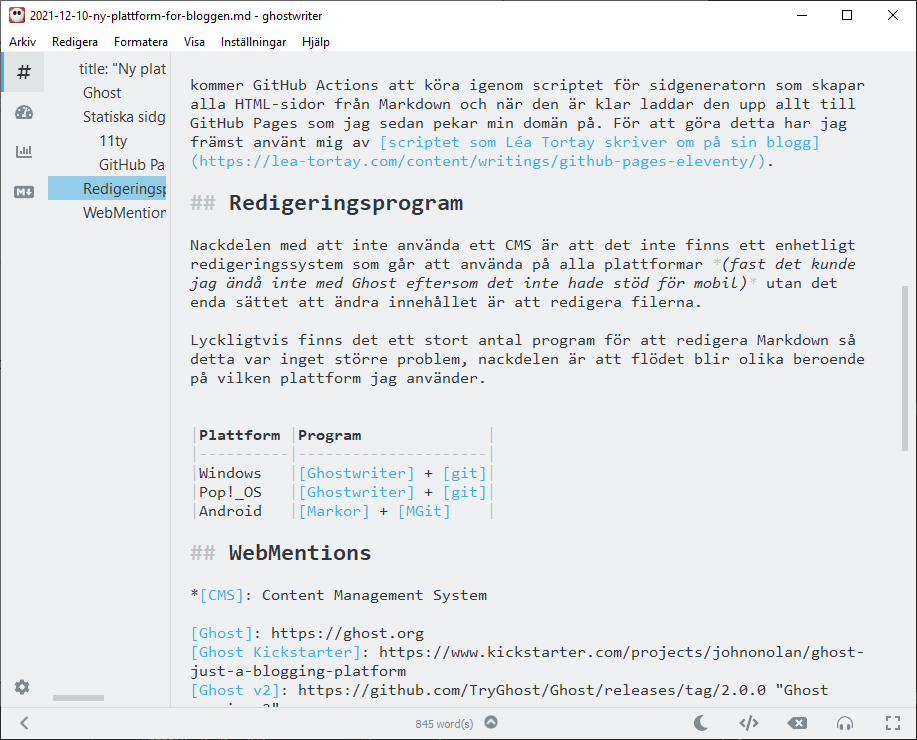

[Från 2013 fram till nu har jag använt plattformen Ghost][Ghost] för att hosta denna webbplatsen. [Ghost var som en frisk fläkt på bloggmarknaden när den kom][Ghost Kickstarter] mot den då (och fortfarande) dominerande plattformen WordPress.{.lead}

WordPress är (och var) en plattform som fastnat och hindras av val som gjordes tidigt i utvecklingen som gör det svårt att bygga nytt, detta gör att plattformen blir besvärlig att använda när en går utanför det primära användningsområdet. På grund av den omfattande användarbasen fanns det oftast små omvägar via plugins och annat för att göra det man ville, men det var sällan logiskt.

## Ghost

Plattformen [Ghost] var simpel i sina funktioner och hade med märkspråket [Markdown][Wikipedia - Markdown] i fokus precis lagom mycket funktioner i form av hantering av inlägg och inställningar. Fördelen plattformen hade 2013 var också den totala avsaknaden av historik som gjorde att de kunde tänka helt nytt.

Under åren började [Ghost] lägga ett större fokus på bilder med snygg visning för gallerier och bilder av olika storlekar, något som passade mig utmärkt eftersom det mesta innehåll jag själv lägger ut är just bilder. [Jag designade bland annat ett tema för Ghost][Saga] med fokus på bildvisning som den nuvarande designen av webbplatsen är baserad på.

[Vid slutet av 2019 hade dock utvecklarnas väg framåt för plattformen ändrats markant][Ghost v3] med funktioner som prenumeranter och nyhetsbrev som de använt för att ta upp striden med [Substack] som ett mer fristående öppet alternativ, ett år tidigare hade även Ghost tagit bort möjligheten att redigera och hantera sin blogg via mobilen [när de släppte den nya redigeringsmodulen][Ghost v2] (fullkomligt absurt i en tid då de små skärmarna ska ha prio ett).

Just att de tog bort möjligheten att redigera via mobilen var det första tecknet på att det var dags att överge skeppet. Under [tågluffen][Tågluffen] kämpade jag ut runt ett blogginlägg om dagen via mobilen trots alla buggar, inget jag vill göra om direkt…

## Statiska sidgeneratorer

Som ett alternativ till Ghost tittade jag på en statisk sidgenererare.

Under 10-talet ökade användningen av statiska sidgeneratorer som [Jekyll] och senare [Hugo] och [11ty] som gör det möjligt att utifrån en mapp- och filstruktur generera helt statiska webbplatser med bara enkel HTML, CSS och JavaScript. Detta kan sedan läggas på vilket webbhotell som helst och som har fördelar över ett traditionellt CMS som genererar sidorna vid varje sidladdning. [GitHub] gjorde tidigt detta genom [GitHub Pages] som enkelt skapade dokumentationssidor med Jekyll. Dessa sidgeneratorer använder oftast Markdown som märkspråk och utifrån konfiguration kan de generera de flesta typer av sidor med fullständig frihet.

### 11ty

Efter lite efterforskning landade jag i [11ty] som plattform främst för att de andra som var stora använde språk som jag inte är så förtjust i (Jekyll använder sig av Ruby och Hugo använder React.js). 11ty är också lätt att installera plugins eller skriva modifikationer själv för.

Precis som de andra sid generatorerna använder 11ty [Markdown][Wikipedia - Markdown] som märkspråk men har möjlighet att på filbasis byta ut detta till nästan vad som helst. Det finns även möjlighet att utöka Markdown med egen syntax eftersom 11ty använder [`markdown-it`][markdown-it]-implementeringen.

Markdown it används av många andra och det finns en stor mängd färdiga plugins för att lägga till olika syntax. På denna bloggen har jag till exempel lagt in `markdown-it-attrs` som gör det möjligt att lägga in attribut på ett element (till exempel så har det första stycket i detta inlägget attributet `{.lead}` som lägger till en klass för styling som ingress).

### GitHub Pages

Som jag skrev tidigare går det att använda vilket webbhotell eller webbhost som helst för statiska sidor men eftersom jag är van vid [git] och [GitHub] så valde jag att hosta webbplatsen via [GitHub Pages] med ett publiceringsflöde med [GitHub Actions]. Varje gång jag pushar till GitHub kommer GitHub Actions att köra igenom scriptet för sidgeneratorn som skapar alla HTML-sidor från Markdown och när den är klar laddar den upp allt till GitHub Pages som jag sedan pekar min domän på. För att göra detta har jag främst använt mig av [scriptet som Léa Tortay skriver om på sin blogg](https://lea-tortay.com/assets/writings/github-pages-eleventy/).

## Redigeringsprogram

Nackdelen med att inte använda ett CMS är att det inte finns ett enhetligt redigeringssystem som går att använda på alla plattformar _(fast det kunde jag ändå inte med Ghost eftersom det inte hade stöd för mobil)_ utan det enda sättet att ändra innehållet är att redigera filerna.

Lyckligtvis finns det ett stort antal program för att redigera Markdown så detta var inget större problem, nackdelen är att flödet blir olika beroende på vilken plattform jag använder.

| Plattform | Program                 |
| --------- | ----------------------- |
| Windows   | [Ghostwriter] + [git]   |
| Pop!\_OS  | [Ghostwriter] + [git]   |
| Android   | [Markor] + [Pocket Git] |

Största nackdelen som jag inte hittat en lösning på än är hanteringen av bilder, i Ghost fanns ett mycket bra flöde där jag kunde ladda upp en bild i hög upplösning som sedan Ghost automatiskt skapade olika storlekar på och komprimerade för webben. Att hitta en smidig lösning för det blir nästa problem att lösa. För tillfället är därför alla bilder i högsta upplösning.

## WebMentions

En direkt fördel med den ökade kontroll den nya plattformen ger är möjligheten att lägga in funktionalitet som Ghost aldrig hade stöd för, den första sådan jag har lagt till är [WebMentions]. WebMentions är en del av [IndieWeb] som är en rörelse som bygger ett alternativ till webben som idag domineras av [Wikipedia - Big Tech].

Indiewebben vill att användarna ska ha kontrollen och där webbplatser kan vara en del av varje persons identitet, på det viset kan man säga att denna webbplats, mitt krypin, är en del av min.

> The IndieWeb is a community of individual personal websites, connected by simple standards, based on the principles of owning your domain, using it as your primary identity, to publish on your own site (optionally syndicate elsewhere), and own your data.

WebMentions är ett protokoll som webbplatser använder för att kommunicera med varandra, en implementering som liknar den tolkning av [hyperlänken som Tim Nelson föreslog där länkarna går åt båda hållen](http://www.ted-hunt.com/HYPERLINKS/index.html). WebMentions är också en uppföljare till [Pingback] som användes förr för att bloggar skulle kunna länka till varandra vid hänvisning.

Implementeringen av WebMentions jag använde är [Max Böcks från 2019](https://mxb.dev/blog/using-webmentions-on-static-sites/) som automatiskt hämtar WebMentions varje gång sidan genereras, i mitt fall är det varje gång jag gör en ändring och en gång i timmen. WebMentions kommer sedan visas efter innehållet på sidan (se nedan).

[^1]: Test av fotnot

\*[CMS]: Content Management System

[Ghost]: https://ghost.org
[Ghost Kickstarter]: https://www.kickstarter.com/projects/johnonolan/ghost-just-a-blogging-platform
[Ghost v2]: https://github.com/TryGhost/Ghost/releases/tag/2.0.0 "Ghost version 2"
[Ghost v3]: https://github.com/TryGhost/Ghost/releases/tag/3.0.0 "Ghost version 3"
[Saga]: https://github.com/Reedyn/Saga
[Wikipedia - Markdown]: https://sv.wikipedia.org/wiki/Markdown
[Wikipedia - Big Tech]: https://en.wikipedia.org/wiki/Big_Tech
[Substack]: https://substack.com
[Jekyll]: https://jekyllrb.com
[Hugo]: https://gohugo.io
[11ty]: https://www.11ty.dev/
[git]: https://git-scm.com
[GitHub]: https://github.com/
[GitHub Pages]: https://pages.github.com
[GitHub Actions]: https://github.com/features/actions
[Tågluffen]: /tagluffen/
[markdown-it]: https://markdown-it.github.io
[Ghostwriter]: https://wereturtle.github.io/ghostwriter/
[Markor]: https://play.google.com/store/apps/details?id=net.gsantner.markor
[Pocket Git]: https://play.google.com/store/apps/details?id=com.aor.pocketgit
[WebMentions]: https://indieweb.org/Webmention
[IndieWeb]: https://indieweb.org
[Pingback]: https://en.wikipedia.org/wiki/Pingback
